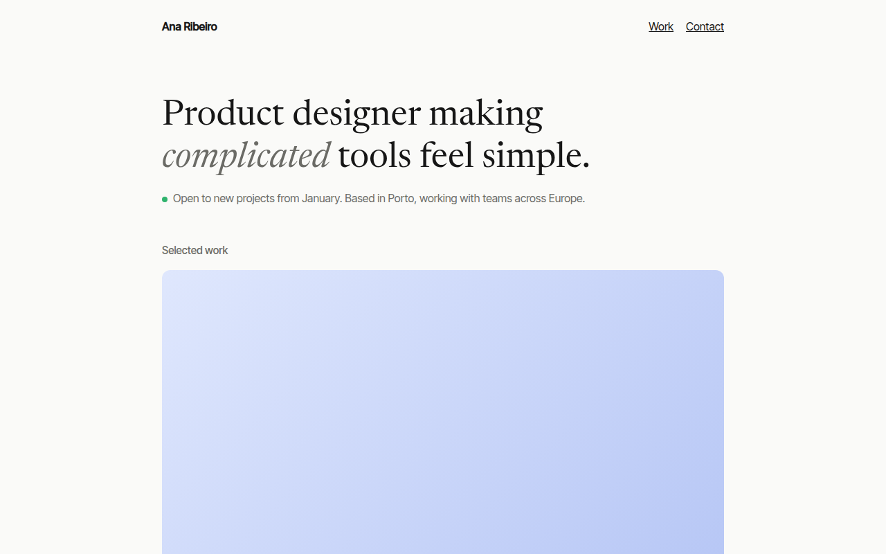

# Minimal Portfolio CSS Template (Free)



**Live demo:** https://mmrahmanbappi.github.io/100-css-designs/10-business-ready/093-portfolio/demo.html
**Details and code:** https://mmrahmanbappi.github.io/100-css-designs/10-business-ready/093-portfolio/

Free minimal portfolio template for a product designer. Short intro, availability status, case study cards, experience list and contact line. Live demo.

## What is minimal portfolio?

A minimal portfolio lets the work speak. One sentence about what you do, a small note on whether you are available, three strong case studies, a short work history and a way to reach you.

The layout is a single narrow column, which reads well on any screen. Case study cards have a gentle hover, and the contact line is big enough that nobody misses it.

## What you get

- Serif intro line with one soft accent
- Green availability dot
- Case study cards with year and one line result
- Experience list with dates and places
- Large contact line with email link

## The key CSS

```css
.w { max-width: 860px; margin: 0 auto; padding: 0 24px; }
h1 { font-family: Newsreader, serif; font-size: clamp(2rem, 5vw, 3.2rem); max-width: 22ch; }
.cs .img { aspect-ratio: 16 / 9; border-radius: 12px; transition: transform .35s; }
.cs:hover .img { transform: scale(.985); }
.row { display: grid; grid-template-columns: 140px 1fr auto; border-top: 1px solid #e5e4de; }
```

## How to use

1. Download `demo.html` from this folder.
2. Change the text, colors and links.
3. Upload it anywhere. One file, no build step.

## License

MIT. Free for personal and commercial use.
