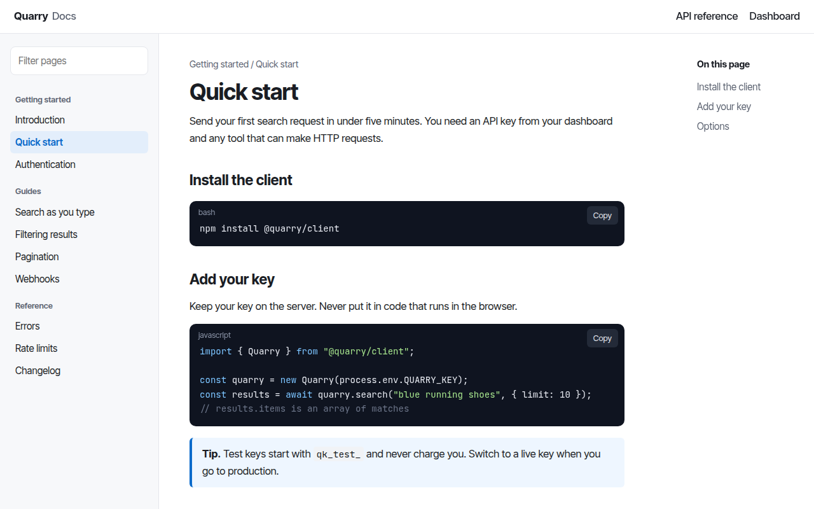

# Docs Site CSS Template (Free)



**Live demo:** https://mmrahmanbappi.github.io/100-css-designs/10-business-ready/094-docs-site/demo.html
**Details and code:** https://mmrahmanbappi.github.io/100-css-designs/10-business-ready/094-docs-site/

Free documentation site template for an API. Sidebar filter, code blocks with copy buttons, callouts, an options table and an on this page menu. Live demo.

## What is docs site?

A docs site needs to be easy to scan and easy to trust. A sidebar to find pages, a readable column in the middle, and an on this page menu on the right, like the docs of Stripe or Vercel.

Code blocks have a language label and a copy button. Tips sit in a colored callout, options are in a table, and the sidebar filter hides pages as you type.

## What you get

- Three column layout with sticky sidebars
- Sidebar filter that hides pages as you type
- Code blocks with language label and copy button
- Tip callout and options table
- Previous and next page links

## The key CSS

```css
.layout { display: grid; grid-template-columns: 250px minmax(0, 1fr) 200px; }
aside.nav { position: sticky; top: 53px; height: calc(100vh - 53px); overflow-y: auto; }
.cb pre { background: #0f1420; color: #e6e9f0; border-radius: 10px; padding: 32px 16px 16px; overflow-x: auto; }
.cb pre code { background: none; padding: 0; }
.note { background: #eef6ff; border-left: 4px solid #0b6bcb; }
```

## How to use

1. Download `demo.html` from this folder.
2. Change the text, colors and links.
3. Upload it anywhere. One file, no build step.

## License

MIT. Free for personal and commercial use.
