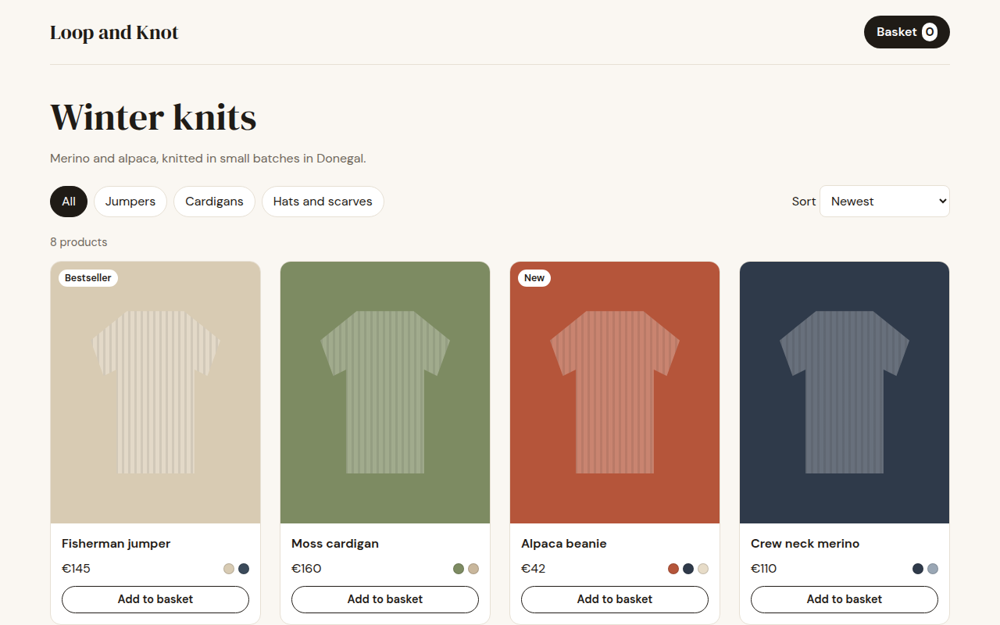

# Shop Product Grid CSS Template (Free)



**Live demo:** https://mmrahmanbappi.github.io/100-css-designs/10-business-ready/095-shop-grid/demo.html
**Details and code:** https://mmrahmanbappi.github.io/100-css-designs/10-business-ready/095-shop-grid/

Free e-commerce product grid template for a knitwear shop. Working category filters, sort by price, color swatches, badges and a basket counter. Live demo.

## What is shop product grid?

A product grid is the heart of any online shop. Clear photos, name, price and colors at a glance, filters at the top and a sort menu, so people find what they want fast.

The products live in one small JavaScript list. Filtering and sorting redraw the grid instantly, and Add to basket updates the counter with a little bump so people know it worked.

## What you get

- Category filter chips that work
- Sort by newest or price
- Color swatches and New or Bestseller badges
- Basket counter that bumps on add
- Four, three or two columns by screen size

## The key CSS

```css
.grid { display: grid; grid-template-columns: repeat(4, 1fr); gap: 24px; }
@media (max-width: 960px) { .grid { grid-template-columns: repeat(3, 1fr); } }
@media (max-width: 700px) { .grid { grid-template-columns: 1fr 1fr; } }
.pr .ph { aspect-ratio: 4 / 5; background: var(--c); }
.chips button[aria-pressed="true"] { background: #1f1b16; color: #fff; }
```

## How to use

1. Download `demo.html` from this folder.
2. Change the text, colors and links.
3. Upload it anywhere. One file, no build step.

## License

MIT. Free for personal and commercial use.
