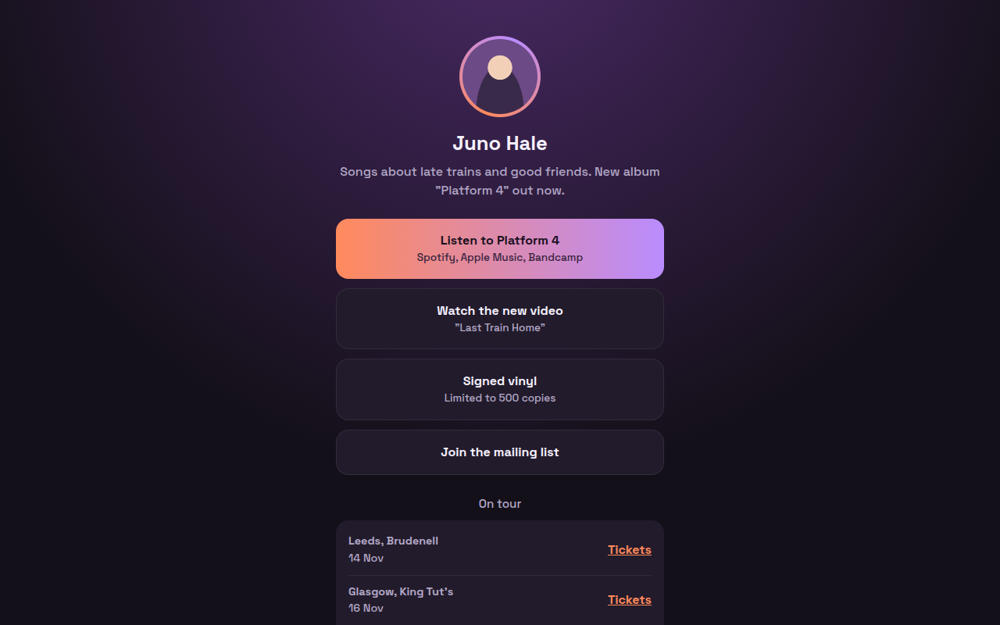

# Link in Bio CSS Template (Free)



**Live demo:** https://mmrahmanbappi.github.io/100-css-designs/10-business-ready/098-link-in-bio/demo.html
**Details and code:** https://mmrahmanbappi.github.io/100-css-designs/10-business-ready/098-link-in-bio/

Free link in bio template for a musician. Mobile first page with big link buttons, tour dates and social links. A free Linktree alternative. Live demo.

## What is link in bio?

A link in bio page is the one link you put on Instagram or TikTok. It needs to load fast on a phone and show your most important links as big buttons you can tap with a thumb.

This one is built for a musician: a highlighted button for the new album, a video, merch, a mailing list, tour dates with ticket links and social profiles. Host it free and you never pay for a link service.

## What you get

- Mobile first single column
- Gradient ring around the profile picture
- One highlighted main link
- Tour dates with ticket links
- Social profile buttons

## The key CSS

```css
main { max-width: 460px; margin: 0 auto; padding: 46px 20px 30px; text-align: center; }
.links a {
  display: block; padding: 16px; border-radius: 16px; margin-bottom: 12px;
  background: #221b2b; font-weight: 700;
}
.links a.hl { background: linear-gradient(90deg, #ff8a5c, #b98cff); color: #1a1020; }
.av { border-radius: 50%; padding: 4px; background: conic-gradient(#ff8a5c, #b98cff, #ff8a5c); }
```

## How to use

1. Download `demo.html` from this folder.
2. Change the text, colors and links.
3. Upload it anywhere. One file, no build step.

## License

MIT. Free for personal and commercial use.
