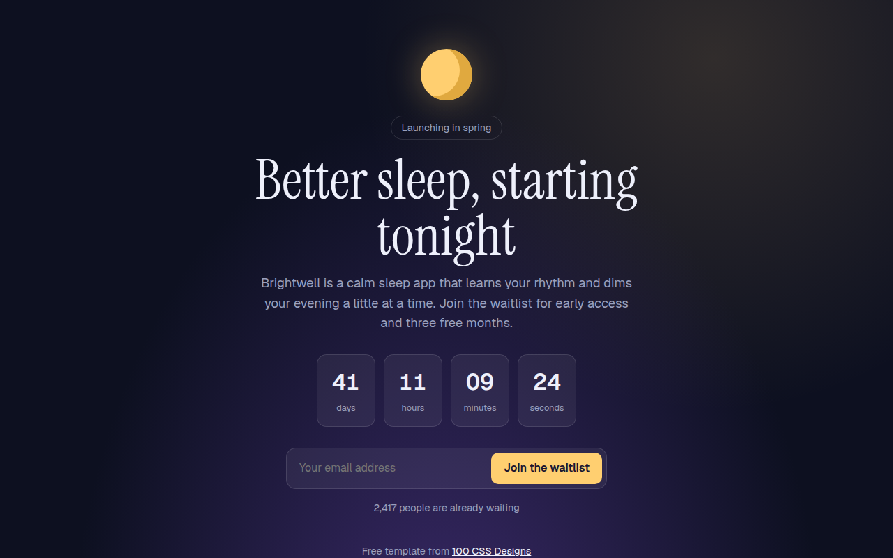

# Waitlist Page CSS Template (Free)



**Live demo:** https://mmrahmanbappi.github.io/100-css-designs/10-business-ready/099-waitlist/demo.html
**Details and code:** https://mmrahmanbappi.github.io/100-css-designs/10-business-ready/099-waitlist/

Free waitlist and coming soon template for an app launch. Live countdown, email sign up that shows your place in line, and a referral link. Live demo.

## What is waitlist page?

A waitlist page collects interest before you launch. It explains the idea in one line, shows how soon it is coming and asks for just an email. After signing up, people see their place in line and a link to share.

The countdown runs live in JavaScript. The sign up swaps the form for a thank you card with a referral link and a copy button, the same trick apps use to spread by word of mouth.

## What you get

- Live countdown in days, hours, minutes and seconds
- Single field email form
- Place in line shown after sign up
- Referral link with a copy button
- Night sky style with a CSS moon

## The key CSS

```css
.cd { display: flex; justify-content: center; gap: 12px; }
.cd div { width: 84px; padding: 14px 0; border-radius: 14px; background: rgba(255,255,255,.06); }
.cd b { font-size: 2rem; font-variant-numeric: tabular-nums; }
form:focus-within { border-color: #ffcf70; }
.moon { border-radius: 50%; background: #ffcf70; box-shadow: inset -18px -6px 0 #e0a93f, 0 0 50px rgba(255,207,112,.35); }
```

## How to use

1. Download `demo.html` from this folder.
2. Change the text, colors and links.
3. Upload it anywhere. One file, no build step.

## License

MIT. Free for personal and commercial use.
