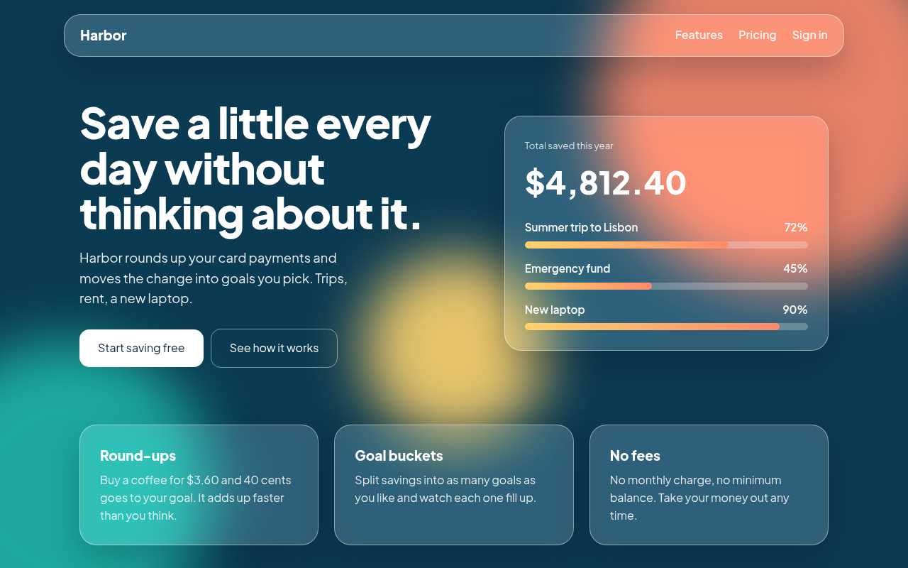
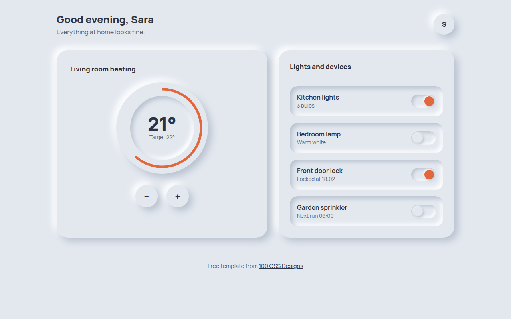
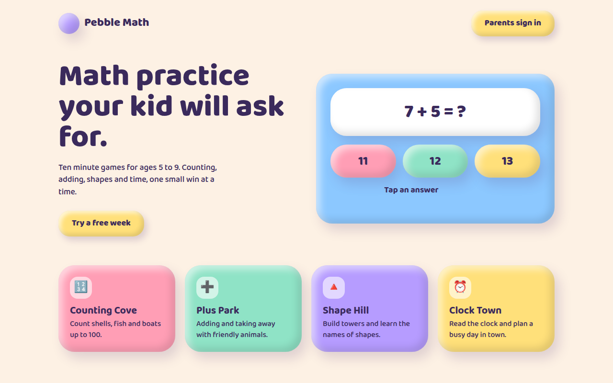
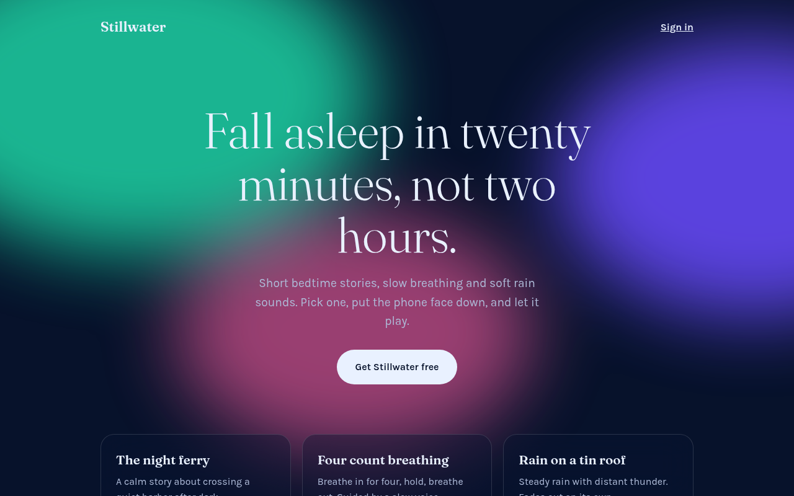
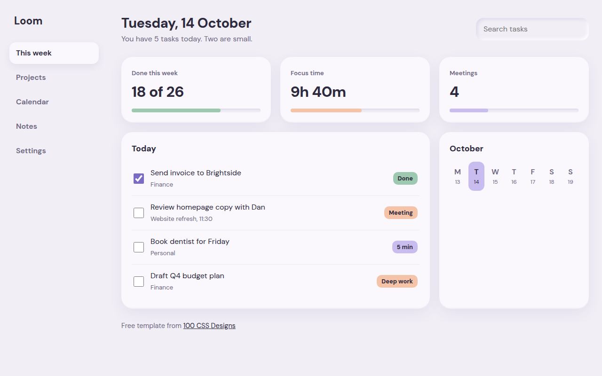
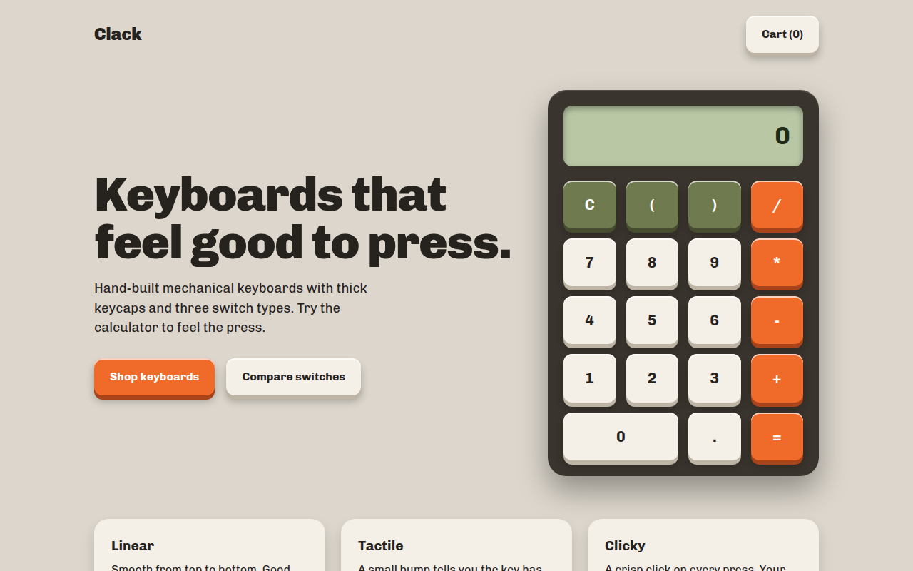

# 100 Free CSS Designs

Trending UI styles built as real pages, with a live demo and a single HTML file for each one. No framework, no build step, free for commercial use.

**Live gallery:** https://mmrahmanbappi.github.io/100-css-designs/

## Designs so far

| # | Design | Example | Live | Preview |
|---|---|---|---|---|
| 001 | [Glassmorphism](https://mmrahmanbappi.github.io/100-css-designs/01-soft-tactile-ui/001-glassmorphism/) | Harbor, a savings app landing page | [Demo](https://mmrahmanbappi.github.io/100-css-designs/01-soft-tactile-ui/001-glassmorphism/demo.html) |  |
| 002 | [Liquid Glass](https://mmrahmanbappi.github.io/100-css-designs/01-soft-tactile-ui/002-liquid-glass/) | Tidewell, a weather app screen | [Demo](https://mmrahmanbappi.github.io/100-css-designs/01-soft-tactile-ui/002-liquid-glass/demo.html) |  |
| 003 | [Neumorphism](https://mmrahmanbappi.github.io/100-css-designs/01-soft-tactile-ui/003-neumorphism/) | Hearth, a smart home control panel | [Demo](https://mmrahmanbappi.github.io/100-css-designs/01-soft-tactile-ui/003-neumorphism/demo.html) |  |
| 004 | [Claymorphism](https://mmrahmanbappi.github.io/100-css-designs/01-soft-tactile-ui/004-claymorphism/) | Pebble Math, a kids learning app | [Demo](https://mmrahmanbappi.github.io/100-css-designs/01-soft-tactile-ui/004-claymorphism/demo.html) |  |
| 005 | [Frosted Aurora](https://mmrahmanbappi.github.io/100-css-designs/01-soft-tactile-ui/005-frosted-aurora/) | Stillwater, a sleep and calm app | [Demo](https://mmrahmanbappi.github.io/100-css-designs/01-soft-tactile-ui/005-frosted-aurora/demo.html) |  |
| 006 | [Soft UI](https://mmrahmanbappi.github.io/100-css-designs/01-soft-tactile-ui/006-soft-ui/) | Loom, a weekly planner dashboard | [Demo](https://mmrahmanbappi.github.io/100-css-designs/01-soft-tactile-ui/006-soft-ui/demo.html) |  |
| 007 | [Skeuomorphism](https://mmrahmanbappi.github.io/100-css-designs/01-soft-tactile-ui/007-skeuomorphism/) | Field Journal, a notes app | [Demo](https://mmrahmanbappi.github.io/100-css-designs/01-soft-tactile-ui/007-skeuomorphism/demo.html) |  |
| 008 | [Tactile Buttons](https://mmrahmanbappi.github.io/100-css-designs/01-soft-tactile-ui/008-tactile-buttons/) | Clack, a keyboard shop with a working calculator | [Demo](https://mmrahmanbappi.github.io/100-css-designs/01-soft-tactile-ui/008-tactile-buttons/demo.html) |  |
| 009 | [Jelly UI](https://mmrahmanbappi.github.io/100-css-designs/01-soft-tactile-ui/009-jelly-ui/) | Wobble, a gelato shop | [Demo](https://mmrahmanbappi.github.io/100-css-designs/01-soft-tactile-ui/009-jelly-ui/demo.html) |  |
| 010 | [Paper Stack](https://mmrahmanbappi.github.io/100-css-designs/01-soft-tactile-ui/010-paper-stack/) | Crumb, a family recipe box | [Demo](https://mmrahmanbappi.github.io/100-css-designs/01-soft-tactile-ui/010-paper-stack/demo.html) |  |

## Categories

- ✅ 1. Soft and Tactile UI
- ⏳ 2. Bold and Raw
- ⏳ 3. Layout Patterns
- ⏳ 4. AI Era Interfaces
- ⏳ 5. Color and Light
- ⏳ 6. Typography
- ⏳ 7. Motion
- ⏳ 8. 3D and Depth
- ⏳ 9. Cultural and Aesthetic
- ⏳ 10. Business Ready Pages

## How to use a design

1. Open the design folder and download `demo.html`.
2. Change the text, colors and links.
3. Upload it anywhere: GitHub Pages, Netlify, Vercel or your own server.

## License

MIT. Use these designs in personal and commercial projects. A star on the repo helps more people find them.
