# 100 Free CSS Designs

Trending UI styles built as real pages, with a live demo and a single HTML file for each one. No framework, no build step, free for commercial use.

**Live gallery:** https://mmrahmanbappi.github.io/100-css-designs/

## All designs

| # | Design | Example | Live | Preview |
|---|---|---|---|---|
| 001 | [Glassmorphism](https://mmrahmanbappi.github.io/100-css-designs/01-soft-tactile-ui/001-glassmorphism/) | Harbor, a savings app landing page | [Demo](https://mmrahmanbappi.github.io/100-css-designs/01-soft-tactile-ui/001-glassmorphism/demo.html) |  |
| 002 | [Liquid Glass](https://mmrahmanbappi.github.io/100-css-designs/01-soft-tactile-ui/002-liquid-glass/) | Tidewell, a weather app screen | [Demo](https://mmrahmanbappi.github.io/100-css-designs/01-soft-tactile-ui/002-liquid-glass/demo.html) |  |
| 003 | [Neumorphism](https://mmrahmanbappi.github.io/100-css-designs/01-soft-tactile-ui/003-neumorphism/) | Hearth, a smart home control panel | [Demo](https://mmrahmanbappi.github.io/100-css-designs/01-soft-tactile-ui/003-neumorphism/demo.html) |  |
| 004 | [Claymorphism](https://mmrahmanbappi.github.io/100-css-designs/01-soft-tactile-ui/004-claymorphism/) | Pebble Math, a kids learning app | [Demo](https://mmrahmanbappi.github.io/100-css-designs/01-soft-tactile-ui/004-claymorphism/demo.html) |  |
| 005 | [Frosted Aurora](https://mmrahmanbappi.github.io/100-css-designs/01-soft-tactile-ui/005-frosted-aurora/) | Stillwater, a sleep and calm app | [Demo](https://mmrahmanbappi.github.io/100-css-designs/01-soft-tactile-ui/005-frosted-aurora/demo.html) |  |
| 006 | [Soft UI](https://mmrahmanbappi.github.io/100-css-designs/01-soft-tactile-ui/006-soft-ui/) | Loom, a weekly planner dashboard | [Demo](https://mmrahmanbappi.github.io/100-css-designs/01-soft-tactile-ui/006-soft-ui/demo.html) |  |
| 007 | [Skeuomorphism](https://mmrahmanbappi.github.io/100-css-designs/01-soft-tactile-ui/007-skeuomorphism/) | Field Journal, a notes app | [Demo](https://mmrahmanbappi.github.io/100-css-designs/01-soft-tactile-ui/007-skeuomorphism/demo.html) |  |
| 008 | [Tactile Buttons](https://mmrahmanbappi.github.io/100-css-designs/01-soft-tactile-ui/008-tactile-buttons/) | Clack, a keyboard shop with a working calculator | [Demo](https://mmrahmanbappi.github.io/100-css-designs/01-soft-tactile-ui/008-tactile-buttons/demo.html) |  |
| 009 | [Jelly UI](https://mmrahmanbappi.github.io/100-css-designs/01-soft-tactile-ui/009-jelly-ui/) | Wobble, a gelato shop | [Demo](https://mmrahmanbappi.github.io/100-css-designs/01-soft-tactile-ui/009-jelly-ui/demo.html) |  |
| 010 | [Paper Stack](https://mmrahmanbappi.github.io/100-css-designs/01-soft-tactile-ui/010-paper-stack/) | Crumb, a family recipe box | [Demo](https://mmrahmanbappi.github.io/100-css-designs/01-soft-tactile-ui/010-paper-stack/demo.html) |  |
| 011 | [Neo Brutalism](https://mmrahmanbappi.github.io/100-css-designs/02-bold-raw/011-neo-brutalism/) | Stackd, an invoicing tool for freelancers | [Demo](https://mmrahmanbappi.github.io/100-css-designs/02-bold-raw/011-neo-brutalism/demo.html) |  |
| 012 | [Raw Brutalist](https://mmrahmanbappi.github.io/100-css-designs/02-bold-raw/012-raw-brutalist/) | KXLR, a community radio station | [Demo](https://mmrahmanbappi.github.io/100-css-designs/02-bold-raw/012-raw-brutalist/demo.html) |  |
| 013 | [Swiss Grid](https://mmrahmanbappi.github.io/100-css-designs/02-bold-raw/013-swiss-grid/) | Grid Days, a design conference in Zurich | [Demo](https://mmrahmanbappi.github.io/100-css-designs/02-bold-raw/013-swiss-grid/demo.html) |  |
| 014 | [Bold Type Hero](https://mmrahmanbappi.github.io/100-css-designs/02-bold-raw/014-bold-type-hero/) | Pace, a running club | [Demo](https://mmrahmanbappi.github.io/100-css-designs/02-bold-raw/014-bold-type-hero/demo.html) |  |
| 015 | [Anti Design](https://mmrahmanbappi.github.io/100-css-designs/02-bold-raw/015-anti-design/) | Static Bloom, an indie record label | [Demo](https://mmrahmanbappi.github.io/100-css-designs/02-bold-raw/015-anti-design/demo.html) |  |
| 016 | [Y2K Revival](https://mmrahmanbappi.github.io/100-css-designs/02-bold-raw/016-y2k-revival/) | Starlite, a mixtape playlist site | [Demo](https://mmrahmanbappi.github.io/100-css-designs/02-bold-raw/016-y2k-revival/demo.html) |  |
| 017 | [Memphis](https://mmrahmanbappi.github.io/100-css-designs/02-bold-raw/017-memphis/) | Confetti Co., a party planner | [Demo](https://mmrahmanbappi.github.io/100-css-designs/02-bold-raw/017-memphis/demo.html) |  |
| 018 | [Retro Pixel](https://mmrahmanbappi.github.io/100-css-designs/02-bold-raw/018-retro-pixel/) | Frog Knight, an indie game launch page | [Demo](https://mmrahmanbappi.github.io/100-css-designs/02-bold-raw/018-retro-pixel/demo.html) |  |
| 019 | [Newspaper Editorial](https://mmrahmanbappi.github.io/100-css-designs/02-bold-raw/019-newspaper-editorial/) | The Harbor Gazette, a local news site | [Demo](https://mmrahmanbappi.github.io/100-css-designs/02-bold-raw/019-newspaper-editorial/demo.html) |  |
| 020 | [Risograph Poster](https://mmrahmanbappi.github.io/100-css-designs/02-bold-raw/020-risograph-poster/) | Ink Fest, a zine fair | [Demo](https://mmrahmanbappi.github.io/100-css-designs/02-bold-raw/020-risograph-poster/demo.html) |  |
| 021 | [Bento Grid](https://mmrahmanbappi.github.io/100-css-designs/03-layout-patterns/021-bento-grid/) | Orbit, a smartwatch product page | [Demo](https://mmrahmanbappi.github.io/100-css-designs/03-layout-patterns/021-bento-grid/demo.html) |  |
| 022 | [Masonry](https://mmrahmanbappi.github.io/100-css-designs/03-layout-patterns/022-masonry/) | Frame Club, a photo community | [Demo](https://mmrahmanbappi.github.io/100-css-designs/03-layout-patterns/022-masonry/demo.html) |  |
| 023 | [Split Screen](https://mmrahmanbappi.github.io/100-css-designs/03-layout-patterns/023-split-screen/) | Salt and Ember, a wood fire restaurant | [Demo](https://mmrahmanbappi.github.io/100-css-designs/03-layout-patterns/023-split-screen/demo.html) |  |
| 024 | [Broken Grid](https://mmrahmanbappi.github.io/100-css-designs/03-layout-patterns/024-broken-grid/) | Nomad Linen, a fashion lookbook | [Demo](https://mmrahmanbappi.github.io/100-css-designs/03-layout-patterns/024-broken-grid/demo.html) |  |
| 025 | [Scrollytelling](https://mmrahmanbappi.github.io/100-css-designs/03-layout-patterns/025-scrollytelling/) | Hilltop Roasters, a bean to cup story | [Demo](https://mmrahmanbappi.github.io/100-css-designs/03-layout-patterns/025-scrollytelling/demo.html) |  |
| 026 | [Horizontal Scroll](https://mmrahmanbappi.github.io/100-css-designs/03-layout-patterns/026-horizontal-scroll/) | A museum timeline of 100 years of trams | [Demo](https://mmrahmanbappi.github.io/100-css-designs/03-layout-patterns/026-horizontal-scroll/demo.html) |  |
| 027 | [Full Bleed](https://mmrahmanbappi.github.io/100-css-designs/03-layout-patterns/027-full-bleed/) | North Atlantic Walks, a hiking tour company | [Demo](https://mmrahmanbappi.github.io/100-css-designs/03-layout-patterns/027-full-bleed/demo.html) |  |
| 028 | [Card Carousel](https://mmrahmanbappi.github.io/100-css-designs/03-layout-patterns/028-card-carousel/) | Kiln, a pottery class studio | [Demo](https://mmrahmanbappi.github.io/100-css-designs/03-layout-patterns/028-card-carousel/demo.html) |  |
| 029 | [Magazine Layout](https://mmrahmanbappi.github.io/100-css-designs/03-layout-patterns/029-magazine-layout/) | Tide and Table, a food and travel magazine | [Demo](https://mmrahmanbappi.github.io/100-css-designs/03-layout-patterns/029-magazine-layout/demo.html) |  |
| 030 | [Long Form Page](https://mmrahmanbappi.github.io/100-css-designs/03-layout-patterns/030-long-form-page/) | Plant a Street, a charity annual report | [Demo](https://mmrahmanbappi.github.io/100-css-designs/03-layout-patterns/030-long-form-page/demo.html) |  |
| 031 | [Chat UI](https://mmrahmanbappi.github.io/100-css-designs/04-ai-era-interfaces/031-chat-ui/) | Wayfarer, an AI travel assistant | [Demo](https://mmrahmanbappi.github.io/100-css-designs/04-ai-era-interfaces/031-chat-ui/demo.html) |  |
| 032 | [AI Dashboard](https://mmrahmanbappi.github.io/100-css-designs/04-ai-era-interfaces/032-ai-dashboard/) | Signalboard, an AI customer support dashboard | [Demo](https://mmrahmanbappi.github.io/100-css-designs/04-ai-era-interfaces/032-ai-dashboard/demo.html) |  |
| 033 | [AI Glow Gradient](https://mmrahmanbappi.github.io/100-css-designs/04-ai-era-interfaces/033-ai-glow-gradient/) | Quill, an AI writing assistant | [Demo](https://mmrahmanbappi.github.io/100-css-designs/04-ai-era-interfaces/033-ai-glow-gradient/demo.html) |  |
| 034 | [Prompt Box Hero](https://mmrahmanbappi.github.io/100-css-designs/04-ai-era-interfaces/034-prompt-box-hero/) | Buildwell, an AI website builder | [Demo](https://mmrahmanbappi.github.io/100-css-designs/04-ai-era-interfaces/034-prompt-box-hero/demo.html) |  |
| 035 | [Node Workflow Canvas](https://mmrahmanbappi.github.io/100-css-designs/04-ai-era-interfaces/035-node-workflow/) | Relay, an automation builder | [Demo](https://mmrahmanbappi.github.io/100-css-designs/04-ai-era-interfaces/035-node-workflow/demo.html) |  |
| 036 | [Streaming Text](https://mmrahmanbappi.github.io/100-css-designs/04-ai-era-interfaces/036-streaming-text/) | Recap, an AI meeting notes tool | [Demo](https://mmrahmanbappi.github.io/100-css-designs/04-ai-era-interfaces/036-streaming-text/demo.html) |  |
| 037 | [Terminal Developer](https://mmrahmanbappi.github.io/100-css-designs/04-ai-era-interfaces/037-terminal-dev/) | shipit, a command line deploy tool | [Demo](https://mmrahmanbappi.github.io/100-css-designs/04-ai-era-interfaces/037-terminal-dev/demo.html) |  |
| 038 | [Linear Style Minimal](https://mmrahmanbappi.github.io/100-css-designs/04-ai-era-interfaces/038-linear-style/) | Tracklet, an issue tracker | [Demo](https://mmrahmanbappi.github.io/100-css-designs/04-ai-era-interfaces/038-linear-style/demo.html) |  |
| 039 | [Spotlight Cards](https://mmrahmanbappi.github.io/100-css-designs/04-ai-era-interfaces/039-spotlight-cards/) | Lumen, an API platform | [Demo](https://mmrahmanbappi.github.io/100-css-designs/04-ai-era-interfaces/039-spotlight-cards/demo.html) |  |
| 040 | [Holographic](https://mmrahmanbappi.github.io/100-css-designs/04-ai-era-interfaces/040-holographic/) | Nova Pass, a festival membership card | [Demo](https://mmrahmanbappi.github.io/100-css-designs/04-ai-era-interfaces/040-holographic/demo.html) |  |
| 041 | [Aurora Gradient](https://mmrahmanbappi.github.io/100-css-designs/05-color-light/041-aurora-gradient/) | Solace, a skincare brand | [Demo](https://mmrahmanbappi.github.io/100-css-designs/05-color-light/041-aurora-gradient/demo.html) |  |
| 042 | [Duotone](https://mmrahmanbappi.github.io/100-css-designs/05-color-light/042-duotone/) | Harbor Film Festival | [Demo](https://mmrahmanbappi.github.io/100-css-designs/05-color-light/042-duotone/demo.html) |  |
| 043 | [Monochrome](https://mmrahmanbappi.github.io/100-css-designs/05-color-light/043-monochrome/) | Atelier Verde, an architecture studio | [Demo](https://mmrahmanbappi.github.io/100-css-designs/05-color-light/043-monochrome/demo.html) |  |
| 044 | [Dark Mode First](https://mmrahmanbappi.github.io/100-css-designs/05-color-light/044-dark-mode/) | Ledgerly, a budget app | [Demo](https://mmrahmanbappi.github.io/100-css-designs/05-color-light/044-dark-mode/demo.html) |  |
| 045 | [Neon Cyberpunk](https://mmrahmanbappi.github.io/100-css-designs/05-color-light/045-neon-cyberpunk/) | Voltage Arena, an esports tournament | [Demo](https://mmrahmanbappi.github.io/100-css-designs/05-color-light/045-neon-cyberpunk/demo.html) |  |
| 046 | [Earthy Natural](https://mmrahmanbappi.github.io/100-css-designs/05-color-light/046-earthy-natural/) | Rootstock Farm, an organic veg box | [Demo](https://mmrahmanbappi.github.io/100-css-designs/05-color-light/046-earthy-natural/demo.html) |  |
| 047 | [Pastel Dream](https://mmrahmanbappi.github.io/100-css-designs/05-color-light/047-pastel-dream/) | Cloud Nine, a baby clothing shop | [Demo](https://mmrahmanbappi.github.io/100-css-designs/05-color-light/047-pastel-dream/demo.html) |  |
| 048 | [High Contrast Accessible](https://mmrahmanbappi.github.io/100-css-designs/05-color-light/048-high-contrast/) | Brookfield Council, a local government site | [Demo](https://mmrahmanbappi.github.io/100-css-designs/05-color-light/048-high-contrast/demo.html) |  |
| 049 | [Grainy Gradient](https://mmrahmanbappi.github.io/100-css-designs/05-color-light/049-grainy-gradient/) | Late Signal, a podcast | [Demo](https://mmrahmanbappi.github.io/100-css-designs/05-color-light/049-grainy-gradient/demo.html) |  |
| 050 | [Glow Borders](https://mmrahmanbappi.github.io/100-css-designs/05-color-light/050-glow-borders/) | Northstar, a hosting pricing page | [Demo](https://mmrahmanbappi.github.io/100-css-designs/05-color-light/050-glow-borders/demo.html) |  |
| 051 | [Kinetic Type](https://mmrahmanbappi.github.io/100-css-designs/06-typography/051-kinetic-type/) | Shift, a dance studio | [Demo](https://mmrahmanbappi.github.io/100-css-designs/06-typography/051-kinetic-type/demo.html) |  |
| 052 | [Variable Fonts](https://mmrahmanbappi.github.io/100-css-designs/06-typography/052-variable-fonts/) | Flexa, a type foundry specimen page | [Demo](https://mmrahmanbappi.github.io/100-css-designs/06-typography/052-variable-fonts/demo.html) |  |
| 053 | [Oversized Serif](https://mmrahmanbappi.github.io/100-css-designs/06-typography/053-oversized-serif/) | Maison Clair, a boutique hotel | [Demo](https://mmrahmanbappi.github.io/100-css-designs/06-typography/053-oversized-serif/demo.html) |  |
| 054 | [Outline Text](https://mmrahmanbappi.github.io/100-css-designs/06-typography/054-outline-text/) | Museum of Sound, an exhibition site | [Demo](https://mmrahmanbappi.github.io/100-css-designs/06-typography/054-outline-text/demo.html) | 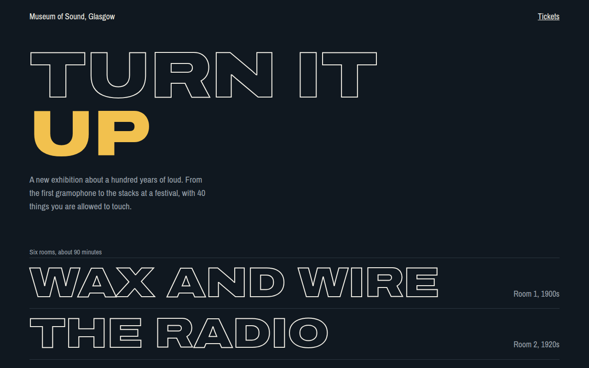 |
| 055 | [Mixed Font Pairing](https://mmrahmanbappi.github.io/100-css-designs/06-typography/055-font-pairing/) | Paper Lantern, an independent bookshop | [Demo](https://mmrahmanbappi.github.io/100-css-designs/06-typography/055-font-pairing/demo.html) | 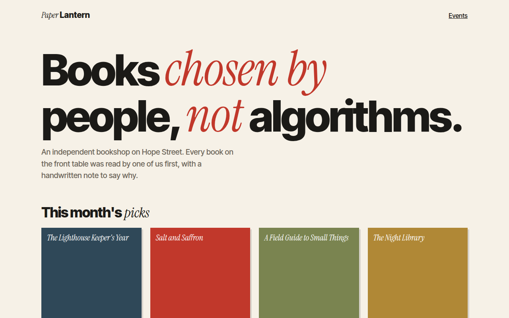 |
| 056 | [Image in Text](https://mmrahmanbappi.github.io/100-css-designs/06-typography/056-image-in-text/) | Alpenglow, a ski resort | [Demo](https://mmrahmanbappi.github.io/100-css-designs/06-typography/056-image-in-text/demo.html) | 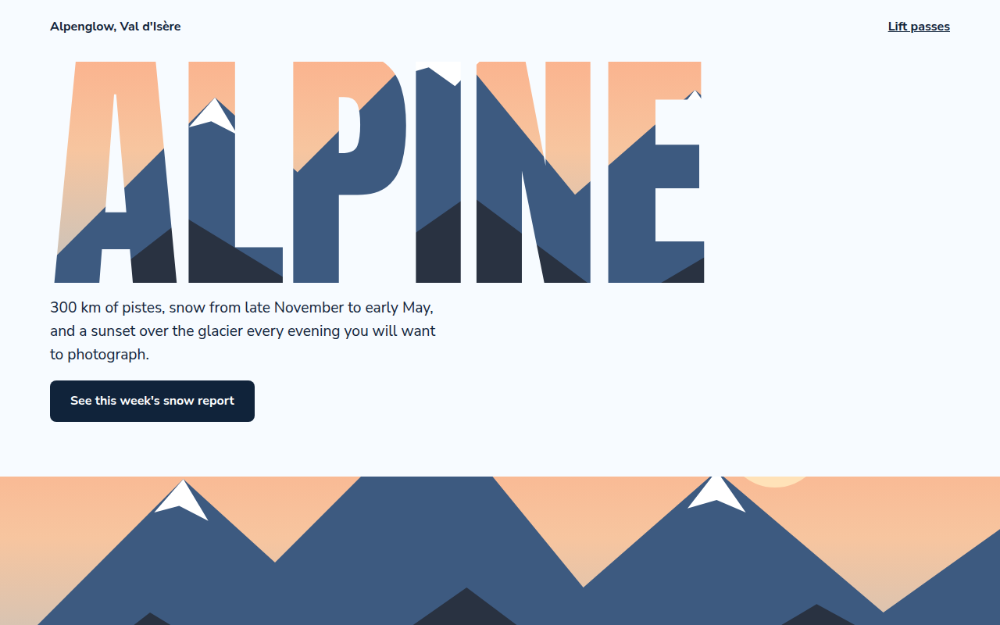 |
| 057 | [Gradient Text](https://mmrahmanbappi.github.io/100-css-designs/06-typography/057-gradient-text/) | Sunset Sound, a festival lineup | [Demo](https://mmrahmanbappi.github.io/100-css-designs/06-typography/057-gradient-text/demo.html) |  |
| 058 | [Handwritten Accents](https://mmrahmanbappi.github.io/100-css-designs/06-typography/058-handwritten-accents/) | Nonna's Kitchen, a cooking school | [Demo](https://mmrahmanbappi.github.io/100-css-designs/06-typography/058-handwritten-accents/demo.html) | 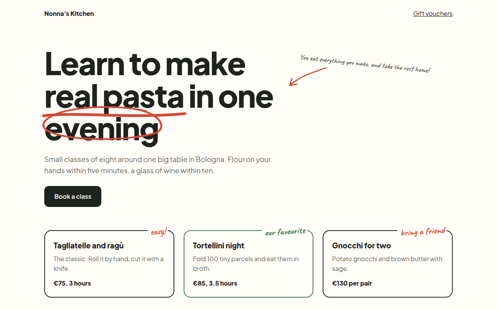 |
| 059 | [Monospace](https://mmrahmanbappi.github.io/100-css-designs/06-typography/059-monospace/) | Byte Sized Weekly, a developer newsletter | [Demo](https://mmrahmanbappi.github.io/100-css-designs/06-typography/059-monospace/demo.html) |  |
| 060 | [Vertical Text](https://mmrahmanbappi.github.io/100-css-designs/06-typography/060-vertical-text/) | Kumo, a Japanese tea house | [Demo](https://mmrahmanbappi.github.io/100-css-designs/06-typography/060-vertical-text/demo.html) |  |
| 061 | [Scroll Driven Animation](https://mmrahmanbappi.github.io/100-css-designs/07-motion/061-scroll-driven/) | Volt Ride, an e-bike product page | [Demo](https://mmrahmanbappi.github.io/100-css-designs/07-motion/061-scroll-driven/demo.html) |  |
| 062 | [View Transitions](https://mmrahmanbappi.github.io/100-css-designs/07-motion/062-view-transitions/) | Fork and Field, a recipe site | [Demo](https://mmrahmanbappi.github.io/100-css-designs/07-motion/062-view-transitions/demo.html) |  |
| 063 | [Micro Interactions](https://mmrahmanbappi.github.io/100-css-designs/07-motion/063-micro-interactions/) | Streak, a habit tracker | [Demo](https://mmrahmanbappi.github.io/100-css-designs/07-motion/063-micro-interactions/demo.html) | 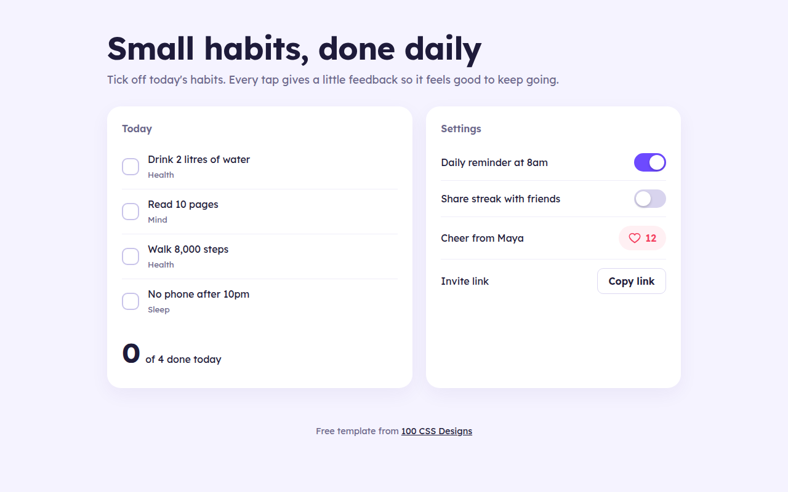 |
| 064 | [Layered Parallax](https://mmrahmanbappi.github.io/100-css-designs/07-motion/064-parallax/) | Pinecrest, a campground | [Demo](https://mmrahmanbappi.github.io/100-css-designs/07-motion/064-parallax/demo.html) |  |
| 065 | [Marquee Ticker](https://mmrahmanbappi.github.io/100-css-designs/07-motion/065-marquee/) | Northline, a design studio | [Demo](https://mmrahmanbappi.github.io/100-css-designs/07-motion/065-marquee/demo.html) |  |
| 066 | [Morphing Blobs](https://mmrahmanbappi.github.io/100-css-designs/07-motion/066-morphing-blobs/) | Bloom, a therapy practice | [Demo](https://mmrahmanbappi.github.io/100-css-designs/07-motion/066-morphing-blobs/demo.html) |  |
| 067 | [Hover Reveal](https://mmrahmanbappi.github.io/100-css-designs/07-motion/067-hover-reveal/) | Studio Halden, an interior design studio | [Demo](https://mmrahmanbappi.github.io/100-css-designs/07-motion/067-hover-reveal/demo.html) |  |
| 068 | [Staggered Entrance](https://mmrahmanbappi.github.io/100-css-designs/07-motion/068-staggered-entrance/) | Pipeline, a CRM landing page | [Demo](https://mmrahmanbappi.github.io/100-css-designs/07-motion/068-staggered-entrance/demo.html) |  |
| 069 | [Skeleton Loaders](https://mmrahmanbappi.github.io/100-css-designs/07-motion/069-skeleton-loaders/) | Morning Brief, a news app | [Demo](https://mmrahmanbappi.github.io/100-css-designs/07-motion/069-skeleton-loaders/demo.html) | 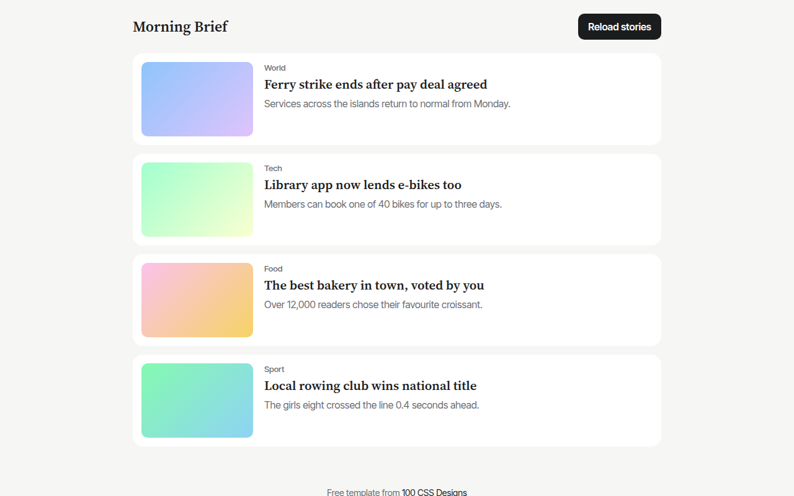 |
| 070 | [Cursor Effects](https://mmrahmanbappi.github.io/100-css-designs/07-motion/070-cursor-effects/) | Oddfellow, a creative studio | [Demo](https://mmrahmanbappi.github.io/100-css-designs/07-motion/070-cursor-effects/demo.html) |  |
| 071 | [3D Tilt Cards](https://mmrahmanbappi.github.io/100-css-designs/08-3d-depth/071-3d-tilt-cards/) | Postcard Club, a postcard subscription | [Demo](https://mmrahmanbappi.github.io/100-css-designs/08-3d-depth/071-3d-tilt-cards/demo.html) |  |
| 072 | [Isometric](https://mmrahmanbappi.github.io/100-css-designs/08-3d-depth/072-isometric/) | Stackyard, a fulfillment warehouse | [Demo](https://mmrahmanbappi.github.io/100-css-designs/08-3d-depth/072-isometric/demo.html) | 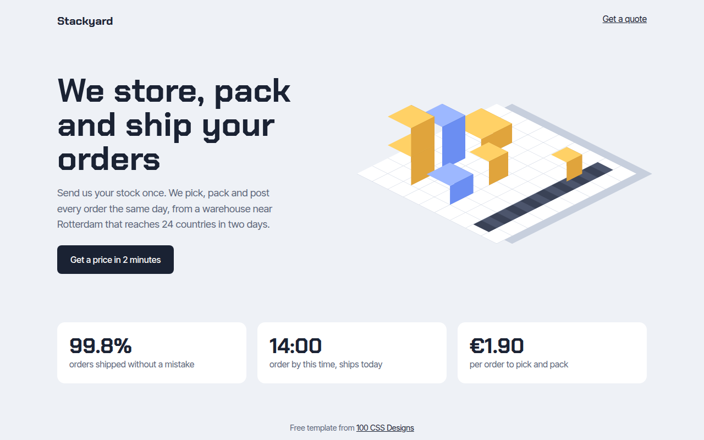 |
| 073 | [Layered Shadows](https://mmrahmanbappi.github.io/100-css-designs/08-3d-depth/073-layered-shadows/) | Forma, a furniture maker | [Demo](https://mmrahmanbappi.github.io/100-css-designs/08-3d-depth/073-layered-shadows/demo.html) |  |
| 074 | [Floating Elements](https://mmrahmanbappi.github.io/100-css-designs/08-3d-depth/074-floating-elements/) | Driftwood, a to-do app | [Demo](https://mmrahmanbappi.github.io/100-css-designs/08-3d-depth/074-floating-elements/demo.html) | 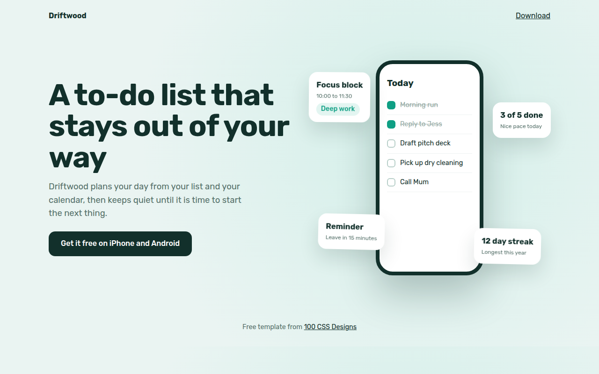 |
| 075 | [Perspective Scroll](https://mmrahmanbappi.github.io/100-css-designs/08-3d-depth/075-perspective-scroll/) | Fieldnote, a year in review page | [Demo](https://mmrahmanbappi.github.io/100-css-designs/08-3d-depth/075-perspective-scroll/demo.html) |  |
| 076 | [Flip Cards](https://mmrahmanbappi.github.io/100-css-designs/08-3d-depth/076-flip-cards/) | Palabra, a Spanish flashcard app | [Demo](https://mmrahmanbappi.github.io/100-css-designs/08-3d-depth/076-flip-cards/demo.html) |  |
| 077 | [3D Product Box](https://mmrahmanbappi.github.io/100-css-designs/08-3d-depth/077-3d-product/) | Kettle Lane, a tea brand | [Demo](https://mmrahmanbappi.github.io/100-css-designs/08-3d-depth/077-3d-product/demo.html) | 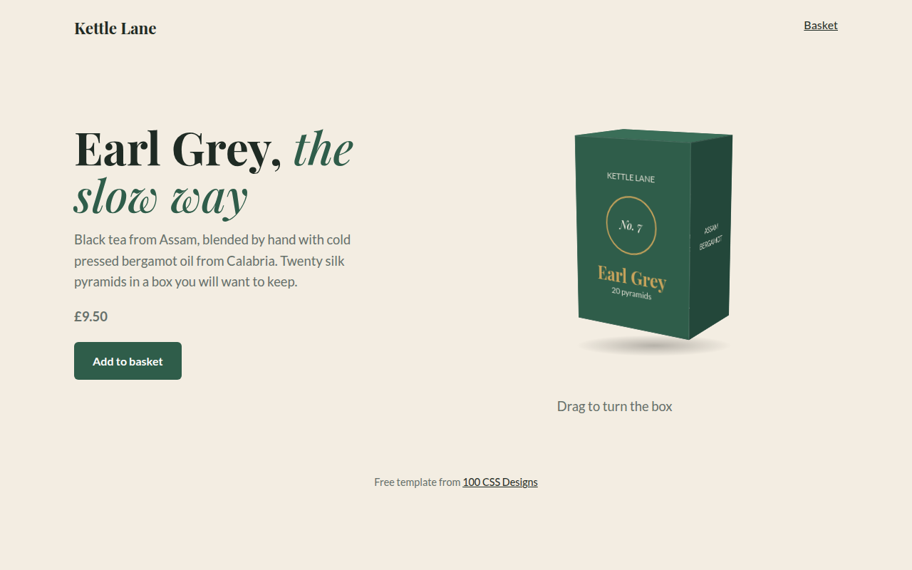 |
| 078 | [Spatial UI](https://mmrahmanbappi.github.io/100-css-designs/08-3d-depth/078-spatial-ui/) | Habitat, a spatial meeting workspace | [Demo](https://mmrahmanbappi.github.io/100-css-designs/08-3d-depth/078-spatial-ui/demo.html) | 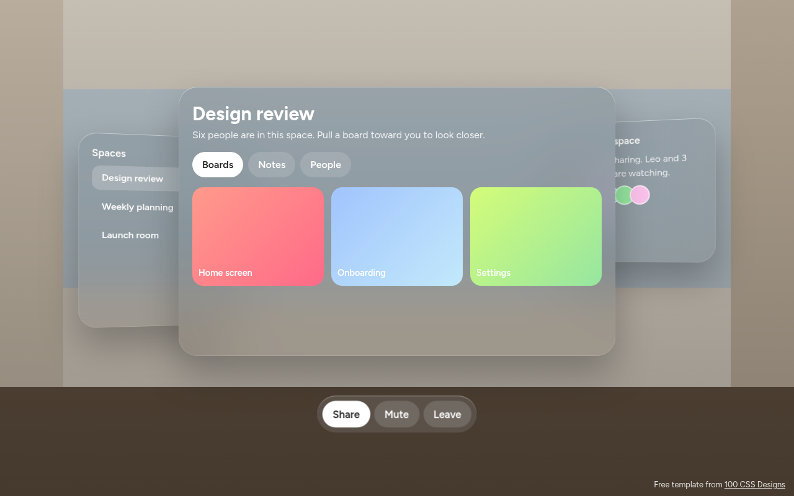 |
| 079 | [Depth Blur](https://mmrahmanbappi.github.io/100-css-designs/08-3d-depth/079-depth-blur/) | Terraza, a family winery | [Demo](https://mmrahmanbappi.github.io/100-css-designs/08-3d-depth/079-depth-blur/demo.html) | 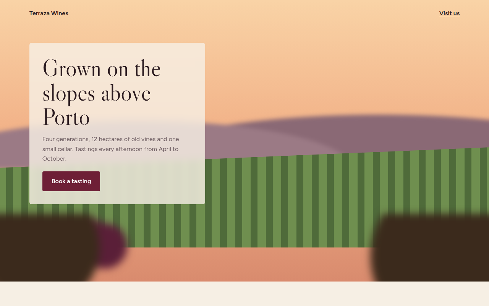 |
| 080 | [Stacked Scroll Cards](https://mmrahmanbappi.github.io/100-css-designs/08-3d-depth/080-stacked-cards/) | Harvest Planner, a garden app | [Demo](https://mmrahmanbappi.github.io/100-css-designs/08-3d-depth/080-stacked-cards/demo.html) |  |
| 081 | [Japandi](https://mmrahmanbappi.github.io/100-css-designs/09-cultural-aesthetic/081-japandi/) | Mado, a ceramics and homeware shop | [Demo](https://mmrahmanbappi.github.io/100-css-designs/09-cultural-aesthetic/081-japandi/demo.html) | 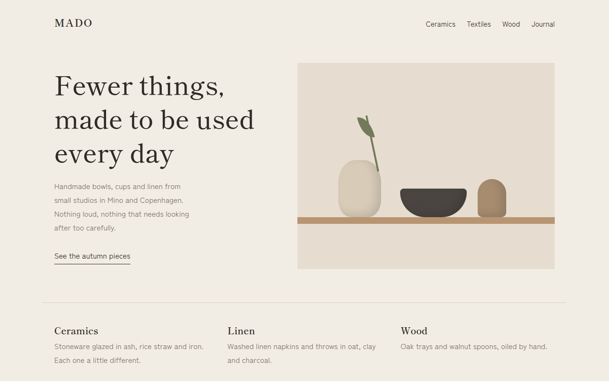 |
| 082 | [Scandinavian](https://mmrahmanbappi.github.io/100-css-designs/09-cultural-aesthetic/082-scandinavian/) | Fjell, cabin rentals in Norway | [Demo](https://mmrahmanbappi.github.io/100-css-designs/09-cultural-aesthetic/082-scandinavian/demo.html) |  |
| 083 | [Cottagecore](https://mmrahmanbappi.github.io/100-css-designs/09-cultural-aesthetic/083-cottagecore/) | Bramble and Bee, a farm jam shop | [Demo](https://mmrahmanbappi.github.io/100-css-designs/09-cultural-aesthetic/083-cottagecore/demo.html) | 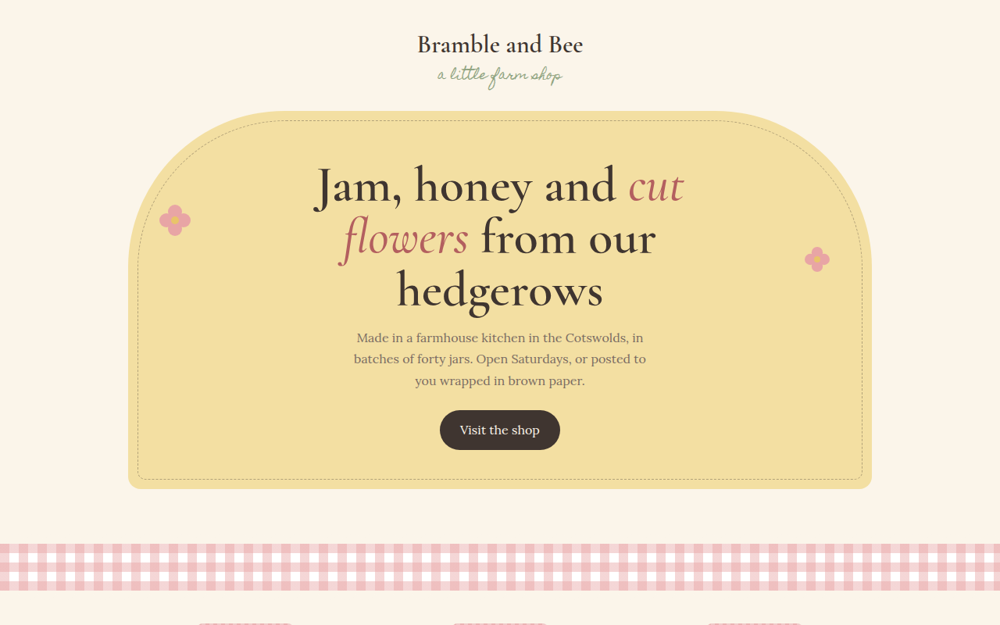 |
| 084 | [Dark Academia](https://mmrahmanbappi.github.io/100-css-designs/09-cultural-aesthetic/084-dark-academia/) | Ravenhall, a reading society | [Demo](https://mmrahmanbappi.github.io/100-css-designs/09-cultural-aesthetic/084-dark-academia/demo.html) | 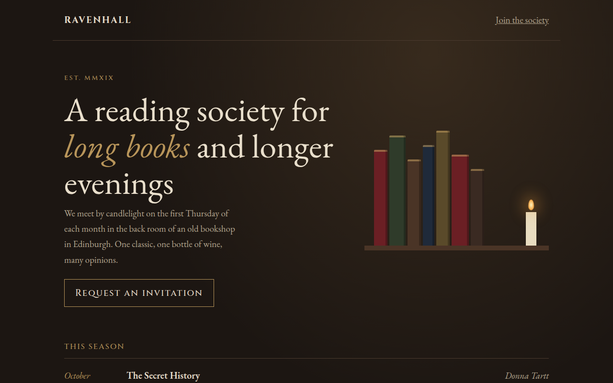 |
| 085 | [Vaporwave](https://mmrahmanbappi.github.io/100-css-designs/09-cultural-aesthetic/085-vaporwave/) | Palm Mall FM, a synth music label | [Demo](https://mmrahmanbappi.github.io/100-css-designs/09-cultural-aesthetic/085-vaporwave/demo.html) | 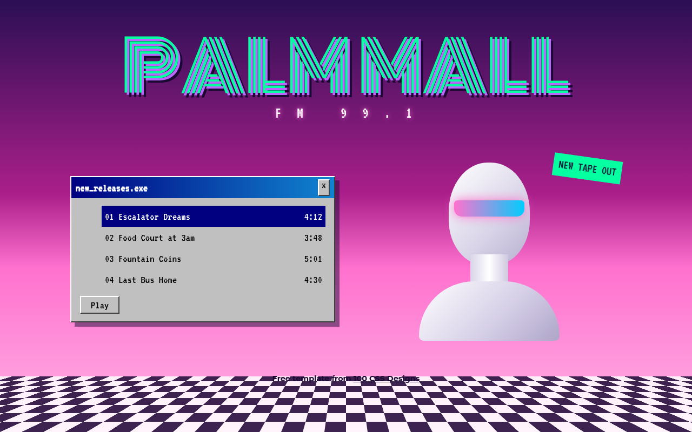 |
| 086 | [Solarpunk](https://mmrahmanbappi.github.io/100-css-designs/09-cultural-aesthetic/086-solarpunk/) | Sunroot, a community solar co-op | [Demo](https://mmrahmanbappi.github.io/100-css-designs/09-cultural-aesthetic/086-solarpunk/demo.html) |  |
| 087 | [Bauhaus](https://mmrahmanbappi.github.io/100-css-designs/09-cultural-aesthetic/087-bauhaus/) | Weimar Workshop, a design exhibition | [Demo](https://mmrahmanbappi.github.io/100-css-designs/09-cultural-aesthetic/087-bauhaus/demo.html) | 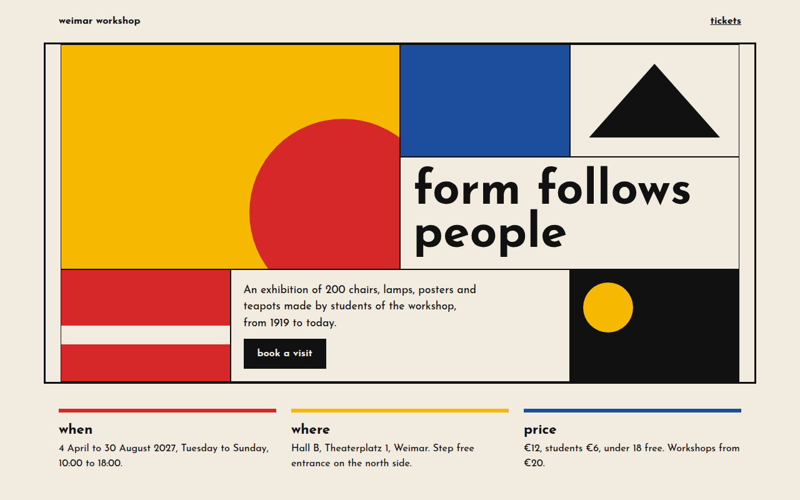 |
| 088 | [Art Deco](https://mmrahmanbappi.github.io/100-css-designs/09-cultural-aesthetic/088-art-deco/) | The Gilded Lily, a cocktail bar | [Demo](https://mmrahmanbappi.github.io/100-css-designs/09-cultural-aesthetic/088-art-deco/demo.html) | 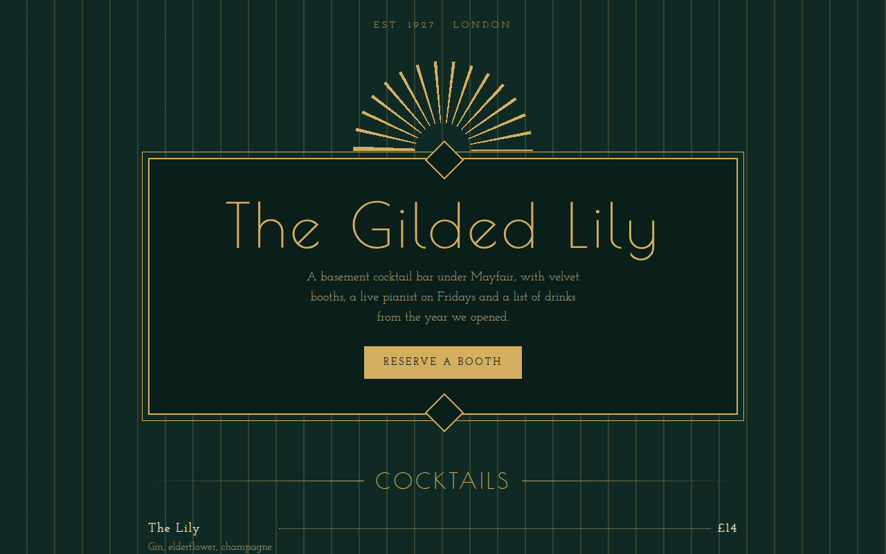 |
| 089 | [Islamic Geometric](https://mmrahmanbappi.github.io/100-css-designs/09-cultural-aesthetic/089-islamic-geometric/) | Riad Zellige, a guesthouse in Marrakech | [Demo](https://mmrahmanbappi.github.io/100-css-designs/09-cultural-aesthetic/089-islamic-geometric/demo.html) |  |
| 090 | [Guochao](https://mmrahmanbappi.github.io/100-css-designs/09-cultural-aesthetic/090-guochao/) | Moonrise Bakery, handmade mooncakes | [Demo](https://mmrahmanbappi.github.io/100-css-designs/09-cultural-aesthetic/090-guochao/demo.html) |  |
| 091 | [SaaS Landing Page](https://mmrahmanbappi.github.io/100-css-designs/10-business-ready/091-saas-landing/) | Formly, a form builder | [Demo](https://mmrahmanbappi.github.io/100-css-designs/10-business-ready/091-saas-landing/demo.html) | 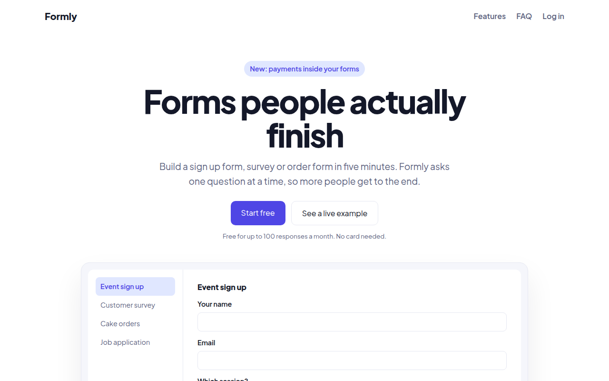 |
| 092 | [Pricing Table](https://mmrahmanbappi.github.io/100-css-designs/10-business-ready/092-pricing-table/) | Notecraft, a notes app | [Demo](https://mmrahmanbappi.github.io/100-css-designs/10-business-ready/092-pricing-table/demo.html) |  |
| 093 | [Minimal Portfolio](https://mmrahmanbappi.github.io/100-css-designs/10-business-ready/093-portfolio/) | Ana Ribeiro, a product designer | [Demo](https://mmrahmanbappi.github.io/100-css-designs/10-business-ready/093-portfolio/demo.html) |  |
| 094 | [Docs Site](https://mmrahmanbappi.github.io/100-css-designs/10-business-ready/094-docs-site/) | Quarry, an API documentation site | [Demo](https://mmrahmanbappi.github.io/100-css-designs/10-business-ready/094-docs-site/demo.html) |  |
| 095 | [Shop Product Grid](https://mmrahmanbappi.github.io/100-css-designs/10-business-ready/095-shop-grid/) | Loop and Knot, a knitwear shop | [Demo](https://mmrahmanbappi.github.io/100-css-designs/10-business-ready/095-shop-grid/demo.html) |  |
| 096 | [Analytics Dashboard](https://mmrahmanbappi.github.io/100-css-designs/10-business-ready/096-analytics-dashboard/) | Tally, a web analytics tool | [Demo](https://mmrahmanbappi.github.io/100-css-designs/10-business-ready/096-analytics-dashboard/demo.html) | 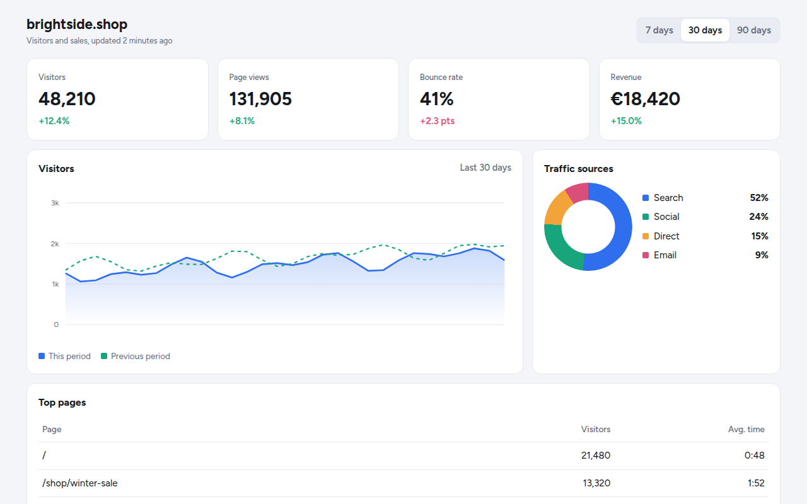 |
| 097 | [Blog](https://mmrahmanbappi.github.io/100-css-designs/10-business-ready/097-blog/) | Small Kitchen Diaries, a food blog | [Demo](https://mmrahmanbappi.github.io/100-css-designs/10-business-ready/097-blog/demo.html) | 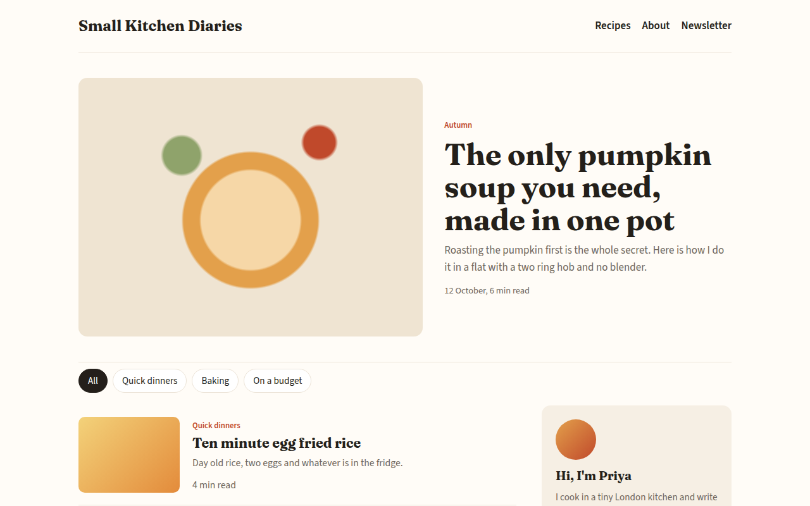 |
| 098 | [Link in Bio](https://mmrahmanbappi.github.io/100-css-designs/10-business-ready/098-link-in-bio/) | Juno Hale, a musician | [Demo](https://mmrahmanbappi.github.io/100-css-designs/10-business-ready/098-link-in-bio/demo.html) |  |
| 099 | [Waitlist Page](https://mmrahmanbappi.github.io/100-css-designs/10-business-ready/099-waitlist/) | Brightwell, a sleep app before launch | [Demo](https://mmrahmanbappi.github.io/100-css-designs/10-business-ready/099-waitlist/demo.html) |  |
| 100 | [Directory Listing](https://mmrahmanbappi.github.io/100-css-designs/10-business-ready/100-directory-listing/) | Course Compass, a college finder | [Demo](https://mmrahmanbappi.github.io/100-css-designs/10-business-ready/100-directory-listing/demo.html) | 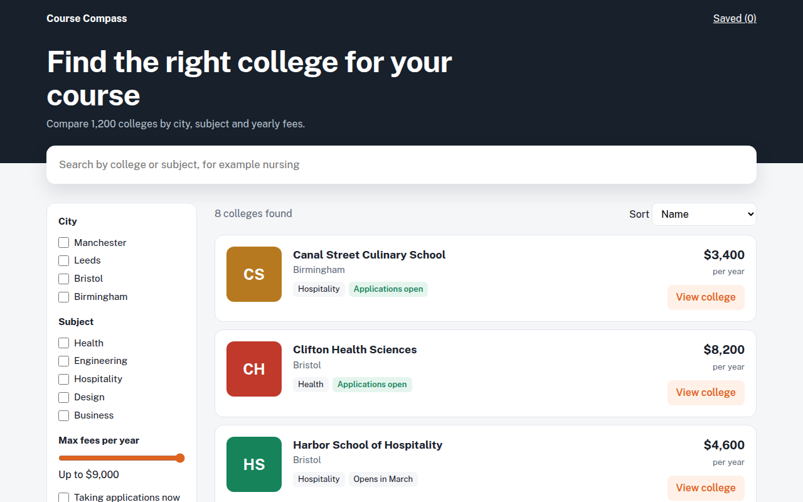 |

## Categories

- 1. Soft and Tactile UI (live)
- 2. Bold and Raw (live)
- 3. Layout Patterns (live)
- 4. AI Era Interfaces (live)
- 5. Color and Light (live)
- 6. Typography (live)
- 7. Motion (live)
- 8. 3D and Depth (live)
- 9. Cultural and Aesthetic (live)
- 10. Business Ready Pages (live)

## How to use a design

1. Open the design folder and download `demo.html`.
2. Change the text, colors and links.
3. Upload it anywhere: GitHub Pages, Netlify, Vercel or your own server.

## License

MIT. Use these designs in personal and commercial projects. A star on the repo helps more people find them.
