# 100 Free CSS Designs

Trending UI styles built as real pages, with a live demo and a single HTML file for each one. No framework, no build step, free for commercial use.

**Live gallery:** https://mmrahmanbappi.github.io/100-css-designs/

## Designs so far

| # | Design | Example | Live | Preview |
|---|---|---|---|---|
| 001 | [Glassmorphism](https://mmrahmanbappi.github.io/100-css-designs/01-soft-tactile-ui/001-glassmorphism/) | Harbor, a savings app landing page | [Demo](https://mmrahmanbappi.github.io/100-css-designs/01-soft-tactile-ui/001-glassmorphism/demo.html) |  |
| 002 | [Liquid Glass](https://mmrahmanbappi.github.io/100-css-designs/01-soft-tactile-ui/002-liquid-glass/) | Tidewell, a weather app screen | [Demo](https://mmrahmanbappi.github.io/100-css-designs/01-soft-tactile-ui/002-liquid-glass/demo.html) |  |
| 003 | [Neumorphism](https://mmrahmanbappi.github.io/100-css-designs/01-soft-tactile-ui/003-neumorphism/) | Hearth, a smart home control panel | [Demo](https://mmrahmanbappi.github.io/100-css-designs/01-soft-tactile-ui/003-neumorphism/demo.html) |  |
| 004 | [Claymorphism](https://mmrahmanbappi.github.io/100-css-designs/01-soft-tactile-ui/004-claymorphism/) | Pebble Math, a kids learning app | [Demo](https://mmrahmanbappi.github.io/100-css-designs/01-soft-tactile-ui/004-claymorphism/demo.html) |  |
| 005 | [Frosted Aurora](https://mmrahmanbappi.github.io/100-css-designs/01-soft-tactile-ui/005-frosted-aurora/) | Stillwater, a sleep and calm app | [Demo](https://mmrahmanbappi.github.io/100-css-designs/01-soft-tactile-ui/005-frosted-aurora/demo.html) |  |
| 006 | [Soft UI](https://mmrahmanbappi.github.io/100-css-designs/01-soft-tactile-ui/006-soft-ui/) | Loom, a weekly planner dashboard | [Demo](https://mmrahmanbappi.github.io/100-css-designs/01-soft-tactile-ui/006-soft-ui/demo.html) |  |
| 007 | [Skeuomorphism](https://mmrahmanbappi.github.io/100-css-designs/01-soft-tactile-ui/007-skeuomorphism/) | Field Journal, a notes app | [Demo](https://mmrahmanbappi.github.io/100-css-designs/01-soft-tactile-ui/007-skeuomorphism/demo.html) |  |
| 008 | [Tactile Buttons](https://mmrahmanbappi.github.io/100-css-designs/01-soft-tactile-ui/008-tactile-buttons/) | Clack, a keyboard shop with a working calculator | [Demo](https://mmrahmanbappi.github.io/100-css-designs/01-soft-tactile-ui/008-tactile-buttons/demo.html) |  |
| 009 | [Jelly UI](https://mmrahmanbappi.github.io/100-css-designs/01-soft-tactile-ui/009-jelly-ui/) | Wobble, a gelato shop | [Demo](https://mmrahmanbappi.github.io/100-css-designs/01-soft-tactile-ui/009-jelly-ui/demo.html) |  |
| 010 | [Paper Stack](https://mmrahmanbappi.github.io/100-css-designs/01-soft-tactile-ui/010-paper-stack/) | Crumb, a family recipe box | [Demo](https://mmrahmanbappi.github.io/100-css-designs/01-soft-tactile-ui/010-paper-stack/demo.html) |  |
| 011 | [Neo Brutalism](https://mmrahmanbappi.github.io/100-css-designs/02-bold-raw/011-neo-brutalism/) | Stackd, an invoicing tool for freelancers | [Demo](https://mmrahmanbappi.github.io/100-css-designs/02-bold-raw/011-neo-brutalism/demo.html) | 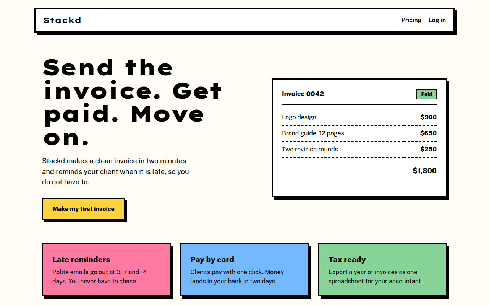 |
| 012 | [Raw Brutalist](https://mmrahmanbappi.github.io/100-css-designs/02-bold-raw/012-raw-brutalist/) | KXLR, a community radio station | [Demo](https://mmrahmanbappi.github.io/100-css-designs/02-bold-raw/012-raw-brutalist/demo.html) |  |
| 013 | [Swiss Grid](https://mmrahmanbappi.github.io/100-css-designs/02-bold-raw/013-swiss-grid/) | Grid Days, a design conference in Zurich | [Demo](https://mmrahmanbappi.github.io/100-css-designs/02-bold-raw/013-swiss-grid/demo.html) | 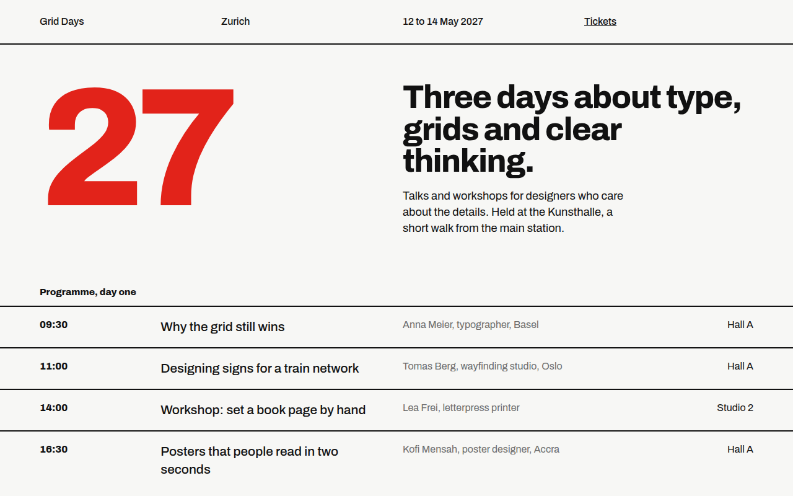 |
| 014 | [Bold Type Hero](https://mmrahmanbappi.github.io/100-css-designs/02-bold-raw/014-bold-type-hero/) | Pace, a running club | [Demo](https://mmrahmanbappi.github.io/100-css-designs/02-bold-raw/014-bold-type-hero/demo.html) | 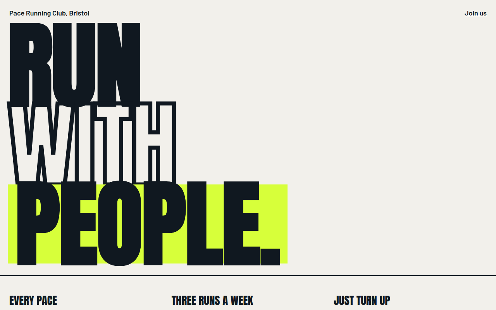 |
| 015 | [Anti Design](https://mmrahmanbappi.github.io/100-css-designs/02-bold-raw/015-anti-design/) | Static Bloom, an indie record label | [Demo](https://mmrahmanbappi.github.io/100-css-designs/02-bold-raw/015-anti-design/demo.html) |  |
| 016 | [Y2K Revival](https://mmrahmanbappi.github.io/100-css-designs/02-bold-raw/016-y2k-revival/) | Starlite, a mixtape playlist site | [Demo](https://mmrahmanbappi.github.io/100-css-designs/02-bold-raw/016-y2k-revival/demo.html) |  |
| 017 | [Memphis](https://mmrahmanbappi.github.io/100-css-designs/02-bold-raw/017-memphis/) | Confetti Co., a party planner | [Demo](https://mmrahmanbappi.github.io/100-css-designs/02-bold-raw/017-memphis/demo.html) | 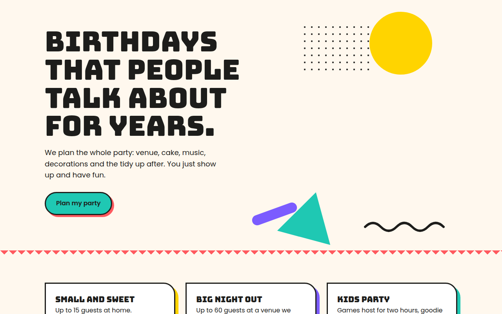 |
| 018 | [Retro Pixel](https://mmrahmanbappi.github.io/100-css-designs/02-bold-raw/018-retro-pixel/) | Frog Knight, an indie game launch page | [Demo](https://mmrahmanbappi.github.io/100-css-designs/02-bold-raw/018-retro-pixel/demo.html) |  |
| 019 | [Newspaper Editorial](https://mmrahmanbappi.github.io/100-css-designs/02-bold-raw/019-newspaper-editorial/) | The Harbor Gazette, a local news site | [Demo](https://mmrahmanbappi.github.io/100-css-designs/02-bold-raw/019-newspaper-editorial/demo.html) |  |
| 020 | [Risograph Poster](https://mmrahmanbappi.github.io/100-css-designs/02-bold-raw/020-risograph-poster/) | Ink Fest, a zine fair | [Demo](https://mmrahmanbappi.github.io/100-css-designs/02-bold-raw/020-risograph-poster/demo.html) | 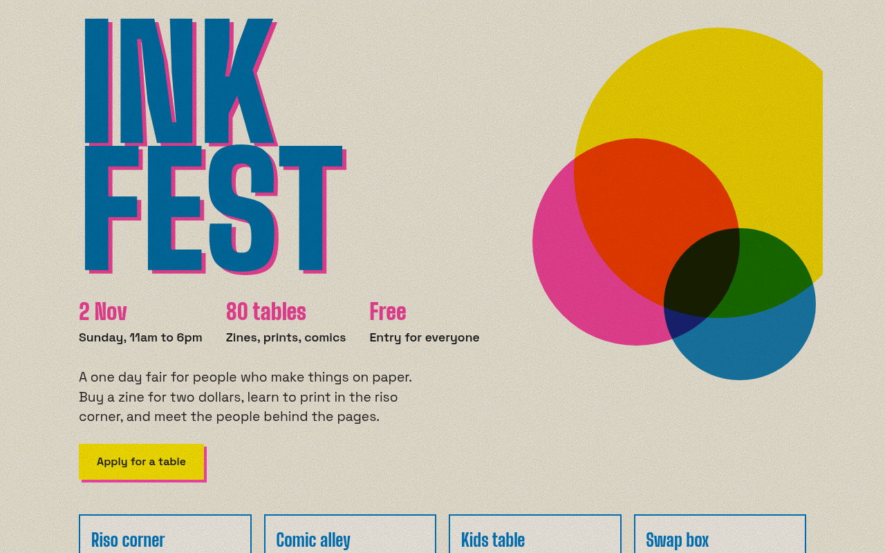 |
| 021 | [Bento Grid](https://mmrahmanbappi.github.io/100-css-designs/03-layout-patterns/021-bento-grid/) | Orbit, a smartwatch product page | [Demo](https://mmrahmanbappi.github.io/100-css-designs/03-layout-patterns/021-bento-grid/demo.html) | 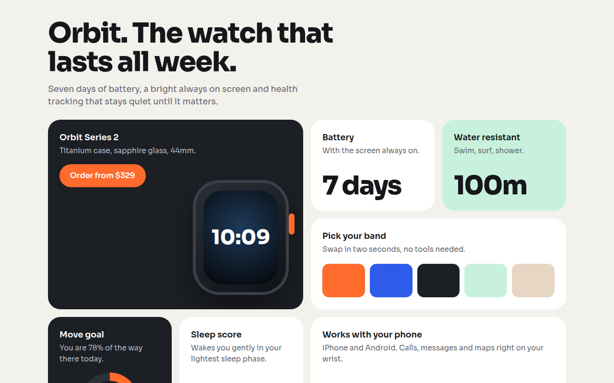 |
| 022 | [Masonry](https://mmrahmanbappi.github.io/100-css-designs/03-layout-patterns/022-masonry/) | Frame Club, a photo community | [Demo](https://mmrahmanbappi.github.io/100-css-designs/03-layout-patterns/022-masonry/demo.html) |  |
| 023 | [Split Screen](https://mmrahmanbappi.github.io/100-css-designs/03-layout-patterns/023-split-screen/) | Salt and Ember, a wood fire restaurant | [Demo](https://mmrahmanbappi.github.io/100-css-designs/03-layout-patterns/023-split-screen/demo.html) | 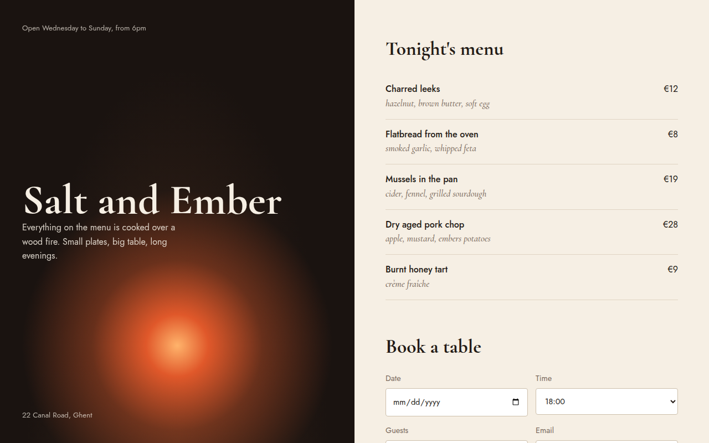 |
| 024 | [Broken Grid](https://mmrahmanbappi.github.io/100-css-designs/03-layout-patterns/024-broken-grid/) | Nomad Linen, a fashion lookbook | [Demo](https://mmrahmanbappi.github.io/100-css-designs/03-layout-patterns/024-broken-grid/demo.html) |  |
| 025 | [Scrollytelling](https://mmrahmanbappi.github.io/100-css-designs/03-layout-patterns/025-scrollytelling/) | Hilltop Roasters, a bean to cup story | [Demo](https://mmrahmanbappi.github.io/100-css-designs/03-layout-patterns/025-scrollytelling/demo.html) | 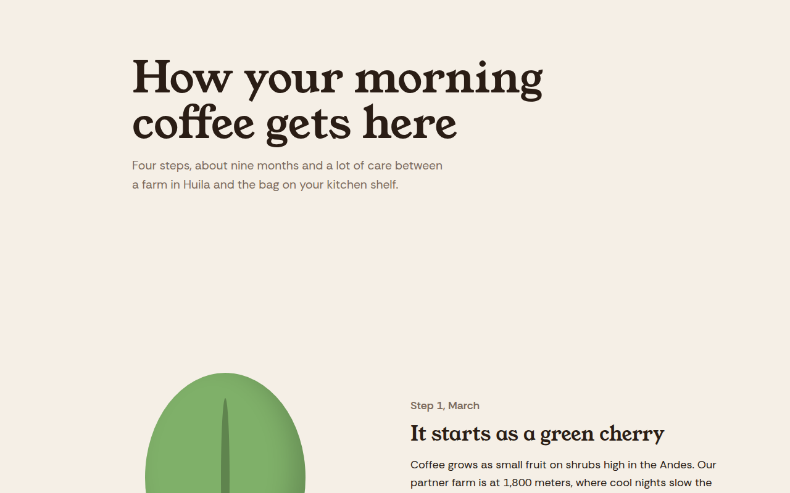 |
| 026 | [Horizontal Scroll](https://mmrahmanbappi.github.io/100-css-designs/03-layout-patterns/026-horizontal-scroll/) | A museum timeline of 100 years of trams | [Demo](https://mmrahmanbappi.github.io/100-css-designs/03-layout-patterns/026-horizontal-scroll/demo.html) | 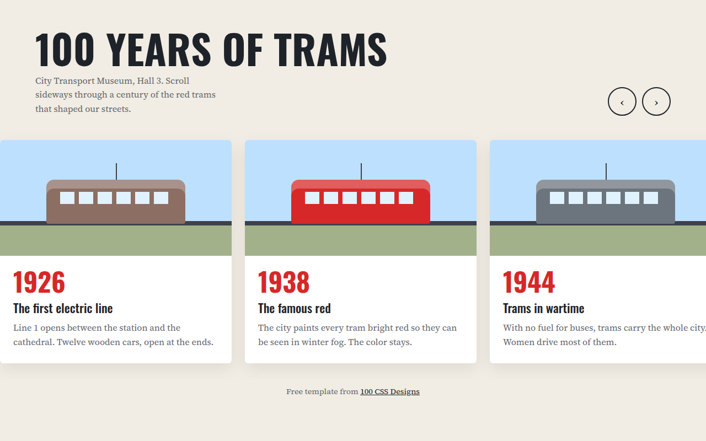 |
| 027 | [Full Bleed](https://mmrahmanbappi.github.io/100-css-designs/03-layout-patterns/027-full-bleed/) | North Atlantic Walks, a hiking tour company | [Demo](https://mmrahmanbappi.github.io/100-css-designs/03-layout-patterns/027-full-bleed/demo.html) | 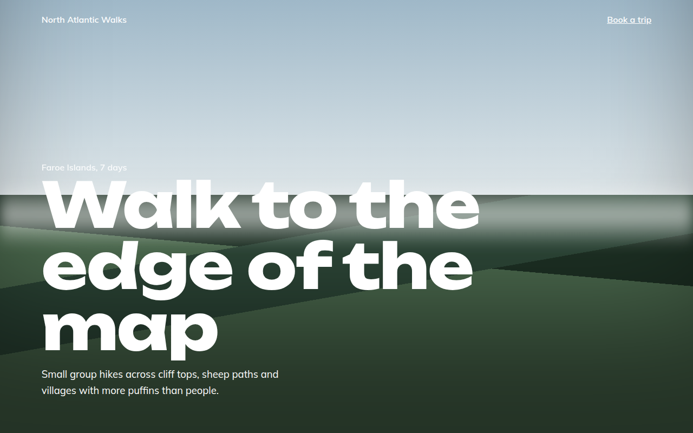 |
| 028 | [Card Carousel](https://mmrahmanbappi.github.io/100-css-designs/03-layout-patterns/028-card-carousel/) | Kiln, a pottery class studio | [Demo](https://mmrahmanbappi.github.io/100-css-designs/03-layout-patterns/028-card-carousel/demo.html) |  |
| 029 | [Magazine Layout](https://mmrahmanbappi.github.io/100-css-designs/03-layout-patterns/029-magazine-layout/) | Tide and Table, a food and travel magazine | [Demo](https://mmrahmanbappi.github.io/100-css-designs/03-layout-patterns/029-magazine-layout/demo.html) |  |
| 030 | [Long Form Page](https://mmrahmanbappi.github.io/100-css-designs/03-layout-patterns/030-long-form-page/) | Plant a Street, a charity annual report | [Demo](https://mmrahmanbappi.github.io/100-css-designs/03-layout-patterns/030-long-form-page/demo.html) | 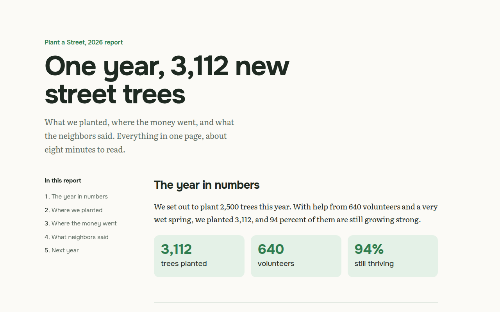 |
| 031 | [Chat UI](https://mmrahmanbappi.github.io/100-css-designs/04-ai-era-interfaces/031-chat-ui/) | Wayfarer, an AI travel assistant | [Demo](https://mmrahmanbappi.github.io/100-css-designs/04-ai-era-interfaces/031-chat-ui/demo.html) |  |
| 032 | [AI Dashboard](https://mmrahmanbappi.github.io/100-css-designs/04-ai-era-interfaces/032-ai-dashboard/) | Signalboard, an AI customer support dashboard | [Demo](https://mmrahmanbappi.github.io/100-css-designs/04-ai-era-interfaces/032-ai-dashboard/demo.html) |  |
| 033 | [AI Glow Gradient](https://mmrahmanbappi.github.io/100-css-designs/04-ai-era-interfaces/033-ai-glow-gradient/) | Quill, an AI writing assistant | [Demo](https://mmrahmanbappi.github.io/100-css-designs/04-ai-era-interfaces/033-ai-glow-gradient/demo.html) |  |
| 034 | [Prompt Box Hero](https://mmrahmanbappi.github.io/100-css-designs/04-ai-era-interfaces/034-prompt-box-hero/) | Buildwell, an AI website builder | [Demo](https://mmrahmanbappi.github.io/100-css-designs/04-ai-era-interfaces/034-prompt-box-hero/demo.html) |  |
| 035 | [Node Workflow Canvas](https://mmrahmanbappi.github.io/100-css-designs/04-ai-era-interfaces/035-node-workflow/) | Relay, an automation builder | [Demo](https://mmrahmanbappi.github.io/100-css-designs/04-ai-era-interfaces/035-node-workflow/demo.html) | 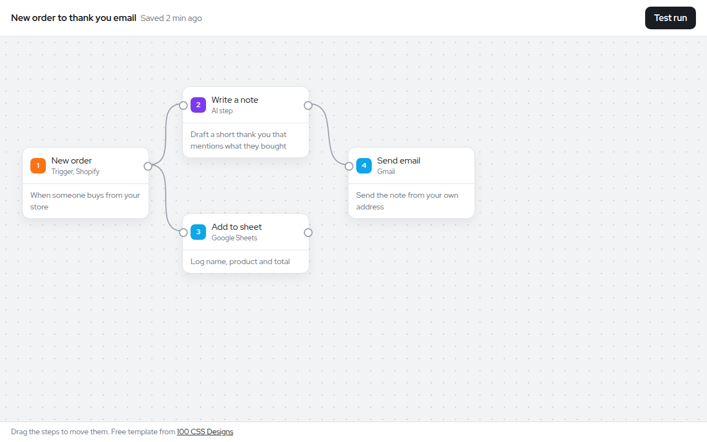 |
| 036 | [Streaming Text](https://mmrahmanbappi.github.io/100-css-designs/04-ai-era-interfaces/036-streaming-text/) | Recap, an AI meeting notes tool | [Demo](https://mmrahmanbappi.github.io/100-css-designs/04-ai-era-interfaces/036-streaming-text/demo.html) | 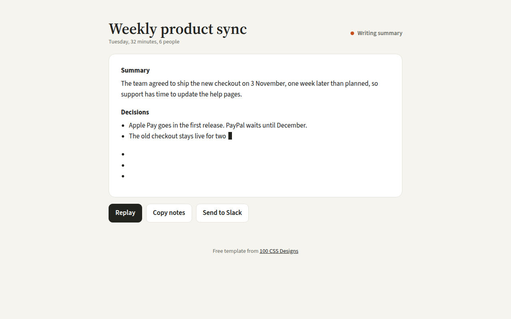 |
| 037 | [Terminal Developer](https://mmrahmanbappi.github.io/100-css-designs/04-ai-era-interfaces/037-terminal-dev/) | shipit, a command line deploy tool | [Demo](https://mmrahmanbappi.github.io/100-css-designs/04-ai-era-interfaces/037-terminal-dev/demo.html) | 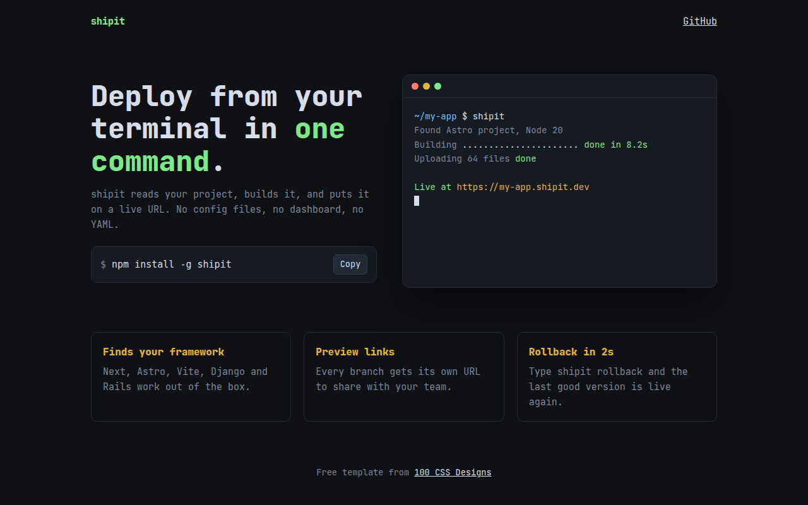 |
| 038 | [Linear Style Minimal](https://mmrahmanbappi.github.io/100-css-designs/04-ai-era-interfaces/038-linear-style/) | Tracklet, an issue tracker | [Demo](https://mmrahmanbappi.github.io/100-css-designs/04-ai-era-interfaces/038-linear-style/demo.html) |  |
| 039 | [Spotlight Cards](https://mmrahmanbappi.github.io/100-css-designs/04-ai-era-interfaces/039-spotlight-cards/) | Lumen, an API platform | [Demo](https://mmrahmanbappi.github.io/100-css-designs/04-ai-era-interfaces/039-spotlight-cards/demo.html) |  |
| 040 | [Holographic](https://mmrahmanbappi.github.io/100-css-designs/04-ai-era-interfaces/040-holographic/) | Nova Pass, a festival membership card | [Demo](https://mmrahmanbappi.github.io/100-css-designs/04-ai-era-interfaces/040-holographic/demo.html) |  |
| 041 | [Aurora Gradient](https://mmrahmanbappi.github.io/100-css-designs/05-color-light/041-aurora-gradient/) | Solace, a skincare brand | [Demo](https://mmrahmanbappi.github.io/100-css-designs/05-color-light/041-aurora-gradient/demo.html) |  |
| 042 | [Duotone](https://mmrahmanbappi.github.io/100-css-designs/05-color-light/042-duotone/) | Harbor Film Festival | [Demo](https://mmrahmanbappi.github.io/100-css-designs/05-color-light/042-duotone/demo.html) |  |
| 043 | [Monochrome](https://mmrahmanbappi.github.io/100-css-designs/05-color-light/043-monochrome/) | Atelier Verde, an architecture studio | [Demo](https://mmrahmanbappi.github.io/100-css-designs/05-color-light/043-monochrome/demo.html) |  |
| 044 | [Dark Mode First](https://mmrahmanbappi.github.io/100-css-designs/05-color-light/044-dark-mode/) | Ledgerly, a budget app | [Demo](https://mmrahmanbappi.github.io/100-css-designs/05-color-light/044-dark-mode/demo.html) | 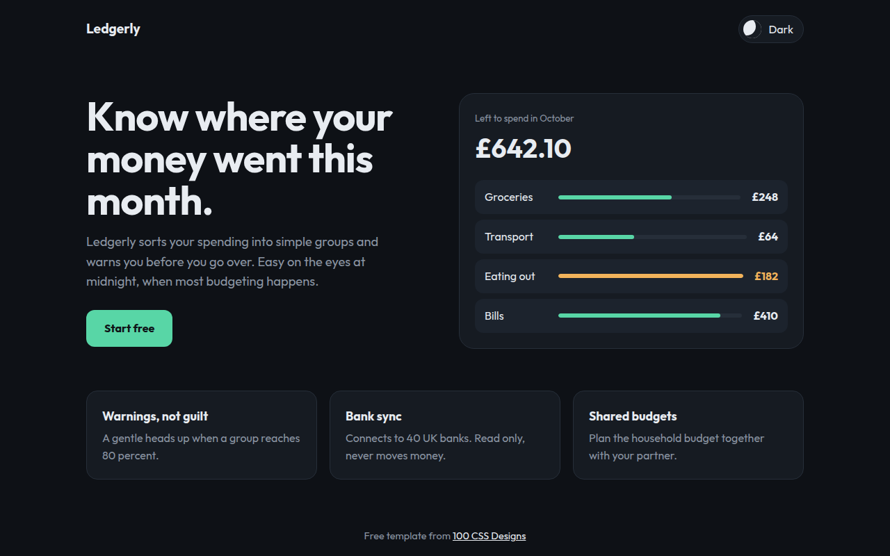 |
| 045 | [Neon Cyberpunk](https://mmrahmanbappi.github.io/100-css-designs/05-color-light/045-neon-cyberpunk/) | Voltage Arena, an esports tournament | [Demo](https://mmrahmanbappi.github.io/100-css-designs/05-color-light/045-neon-cyberpunk/demo.html) | 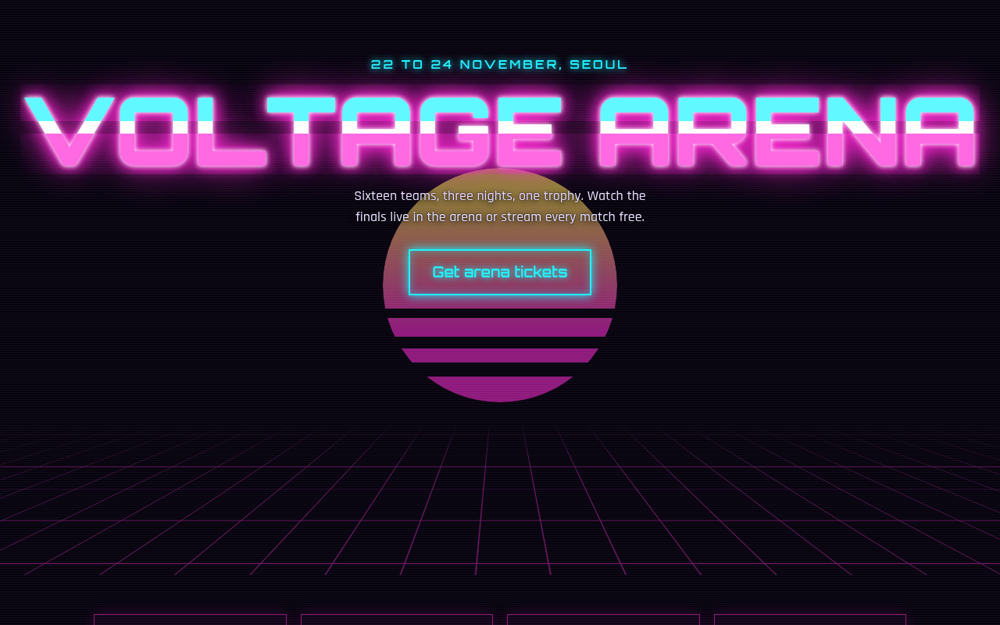 |
| 046 | [Earthy Natural](https://mmrahmanbappi.github.io/100-css-designs/05-color-light/046-earthy-natural/) | Rootstock Farm, an organic veg box | [Demo](https://mmrahmanbappi.github.io/100-css-designs/05-color-light/046-earthy-natural/demo.html) | 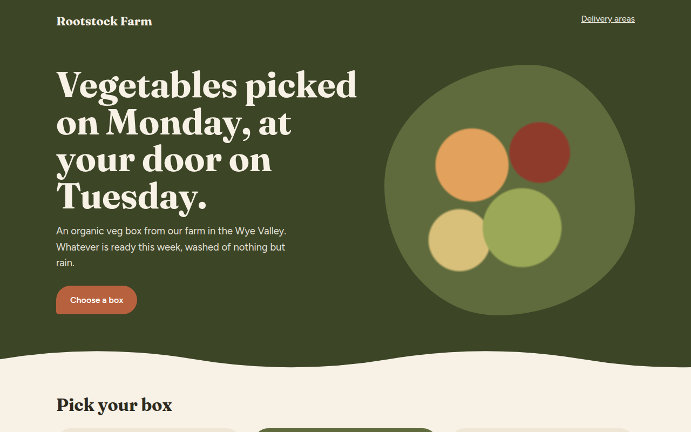 |
| 047 | [Pastel Dream](https://mmrahmanbappi.github.io/100-css-designs/05-color-light/047-pastel-dream/) | Cloud Nine, a baby clothing shop | [Demo](https://mmrahmanbappi.github.io/100-css-designs/05-color-light/047-pastel-dream/demo.html) |  |
| 048 | [High Contrast Accessible](https://mmrahmanbappi.github.io/100-css-designs/05-color-light/048-high-contrast/) | Brookfield Council, a local government site | [Demo](https://mmrahmanbappi.github.io/100-css-designs/05-color-light/048-high-contrast/demo.html) |  |
| 049 | [Grainy Gradient](https://mmrahmanbappi.github.io/100-css-designs/05-color-light/049-grainy-gradient/) | Late Signal, a podcast | [Demo](https://mmrahmanbappi.github.io/100-css-designs/05-color-light/049-grainy-gradient/demo.html) | 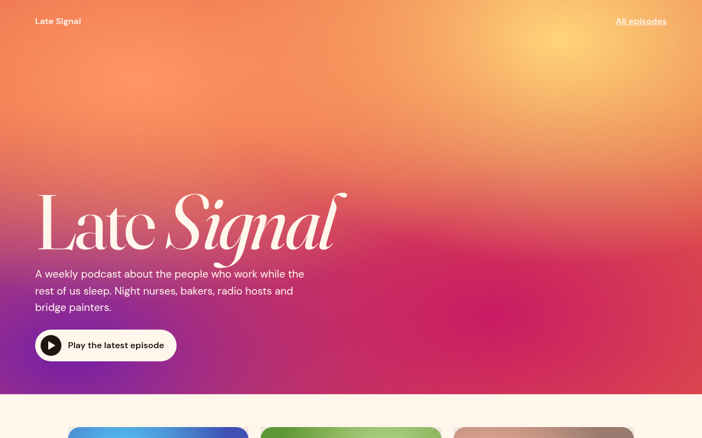 |
| 050 | [Glow Borders](https://mmrahmanbappi.github.io/100-css-designs/05-color-light/050-glow-borders/) | Northstar, a hosting pricing page | [Demo](https://mmrahmanbappi.github.io/100-css-designs/05-color-light/050-glow-borders/demo.html) |  |

## Categories

- 1. Soft and Tactile UI (live)
- 2. Bold and Raw (live)
- 3. Layout Patterns (live)
- 4. AI Era Interfaces (live)
- 5. Color and Light (live)
- 6. Typography (coming soon)
- 7. Motion (coming soon)
- 8. 3D and Depth (coming soon)
- 9. Cultural and Aesthetic (coming soon)
- 10. Business Ready Pages (coming soon)

## How to use a design

1. Open the design folder and download `demo.html`.
2. Change the text, colors and links.
3. Upload it anywhere: GitHub Pages, Netlify, Vercel or your own server.

## License

MIT. Use these designs in personal and commercial projects. A star on the repo helps more people find them.
